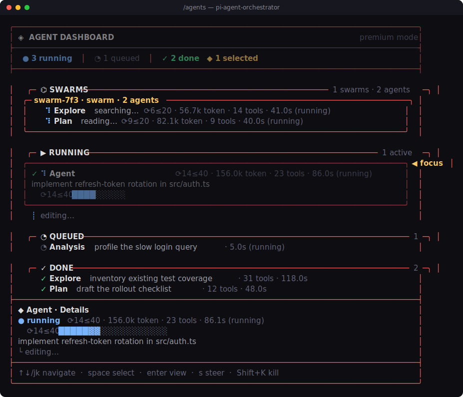

# @onlinechefgroep/pi-agent-orchestrator

> Multi-agent orchestrator for Pi coding agents — sub-agents, handoffs, prompt compression, scheduling, and an interactive TUI dashboard.

[](https://www.npmjs.com/package/@onlinechefgroep/pi-agent-orchestrator)
[](https://opensource.org/licenses/MIT)
[](https://github.com/OnlineChefGroep/pi-agent-orchestrator/actions)

## What is this?

A Pi extension that adds autonomous sub-agent orchestration to Pi coding agents. Spawn specialized agents (Explore, Plan, Analysis, general-purpose, or custom), chain them via structured handoffs, schedule recurring jobs, and coordinate multi-agent swarms — all from a vim-style interactive TUI dashboard.

## Real terminal showcase

The video is captured from the compiled dashboard, resource top-view, and widget renderers. Remotion supplies the framing and encode; the terminal content is generated by the actual implementation.

[](https://onlinechefgroep.github.io/pi-agent-orchestrator/assets/dashboard_preview.mp4)

- [Watch the MP4 showcase](https://onlinechefgroep.github.io/pi-agent-orchestrator/assets/dashboard_preview.mp4)
- [Open the agent-readable project site](https://onlinechefgroep.github.io/pi-agent-orchestrator/)

## Installation

**Prerequisites:** A working Pi host environment with `@earendil-works/pi-coding-agent`.

Install the extension globally into your Pi environment:

```bash
pi install npm:@onlinechefgroep/pi-agent-orchestrator
```

Or install it locally for the current project only:

```bash
pi install npm:@onlinechefgroep/pi-agent-orchestrator -l
```

## Quick start

After installation, start a Pi session and type `/agents` to open the dashboard.

- The Pi **footer status bar** can show live subagent counts (e.g. `2 running agents`) via the `subagents` status slot — the widget binds on session start and updates the slot when agents are active.
- Press `t` for the resource top view, `?` for the help overlay, `z` for daemon schedules.
- Navigate the agent list with `j`/`k` or the arrow keys.
- Create a custom agent by creating `.pi/agents/my-agent.md` with frontmatter (see [Custom Agents](docs/custom-agents.md) for details).

## Keyboard cheatsheet

| Key | Action |
|-----|--------|
| `j`/`k` or `Up`/`Down` | Navigate agent list |
| `t` | Toggle top/resource view |
| `z` | Toggle schedule view |
| `?` | Help overlay |
| `/perf` | Performance metrics |
| `Shift+K` | Kill selected agent(s) |
| `Space` | Multi-select |
| `g`/`G` | Jump to first/last |
| `Esc`/`q` | Close overlay or dashboard |

## Features

- **Interactive TUI Dashboard** — six views: agent list, resource top, daemon schedules, performance metrics, help overlay, and settings.
- **Live footer status** — running/queued agent counts in Pi's status bar (`subagents` slot), bound on session start.
- **Sub-agent System** — spawn specialized agents with permission inheritance and partition filtering. Default orchestration mode is `single` (multi-agent modes are opt-in).
- **Prompt Compression** — static system-prompt guidance profiles with global defaults and per-agent overrides; this does not compact conversation history. See [scope and impact](docs/prompt-compression.md).
- **Cron Scheduling** — persistent recurring jobs with a daemon schedule view.
- **Handoff Protocol** — JSON-based handoffs for chain-of-agents workflows.
- **Custom Agents** — Markdown frontmatter definitions in `.pi/agents/*.md`.
- **Swarm Coordination** — dynamic multi-agent swarm join/leave with real-time status.
- **Cross-extension RPC** — peer-extension integration for composable tool chains.

## Custom agent example

Create `.pi/agents/typescript-reviewer.md`:

```markdown
---
display_name: "TypeScript Reviewer"
description: "Read-only reviewer for TypeScript changes"
tools: read, grep, find, ls, bash
disallowed_tools: write, edit
extensions: false
skills: true
max_turns: 20
prompt_mode: replace
---
You are a senior TypeScript code reviewer.

Focus on type safety, error handling, async control flow, and maintainability.
Report findings with severity, exact file paths, and actionable fixes.
Never modify files.
```

See [Custom Agents](docs/custom-agents.md) for the full authoring guide.

## Showcase development

Render the current compiled TUI into a 1080p MP4 and poster:

```bash
npm run showcase:remotion
```

The pipeline is self-contained under `showcase/remotion/`. It runs `scripts/showcase-live-demo.mjs --auto`, records actual terminal frames, and renders them with Remotion. Set `REMOTION_BROWSER_EXECUTABLE` only when a local custom browser binary is required.

## Agent-readable documentation

- [`docs/prompt-compression.md`](docs/prompt-compression.md) — exact scope, limitations, and measurement guidance for prompt compression.
- [`llms.txt`](llms.txt) — compact discovery index.
- [`llms-full.txt`](llms-full.txt) — expanded project context.
- [`sitemap.md`](sitemap.md) — human- and agent-readable site map.
- [`AGENTS.md`](AGENTS.md) — repository invariants and coding-agent guidance.
- [`agent-permissions.json`](agent-permissions.json) — read-only website action policy.

## Development

```bash
npm install
npm run setup:hooks   # git hooks (opt-in)
npm test
npm run lint:fix
npm run typecheck
```

## License

MIT © OnlineChefGroep
