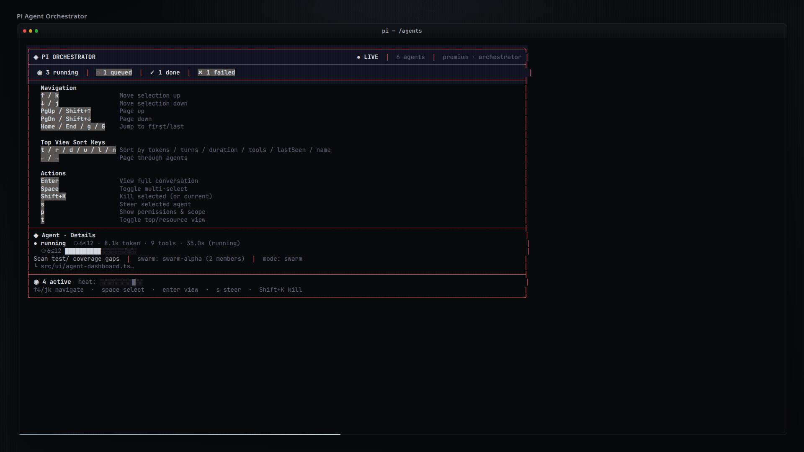
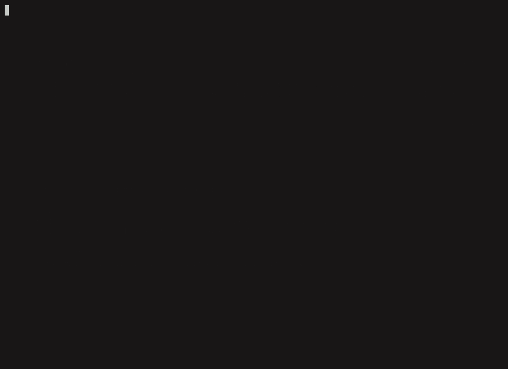
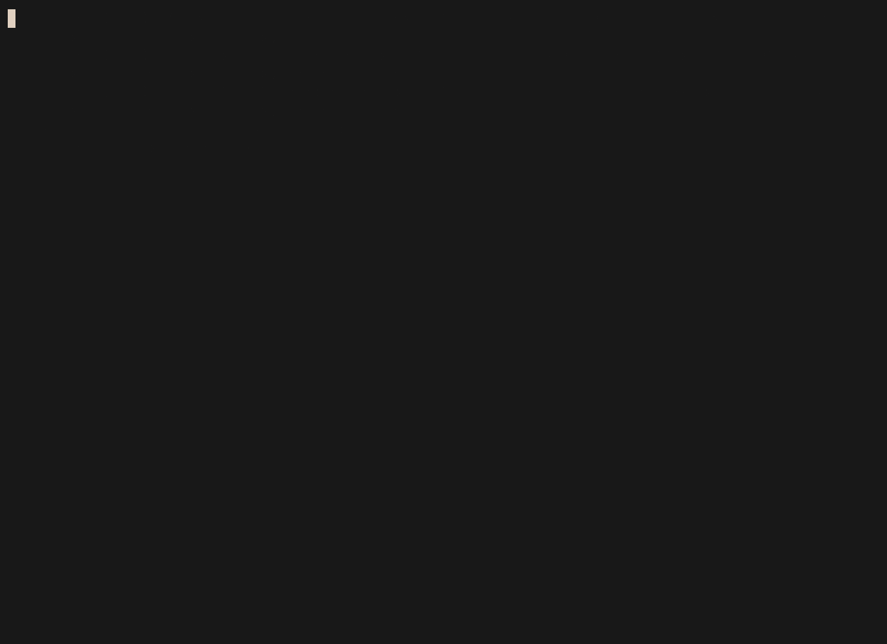
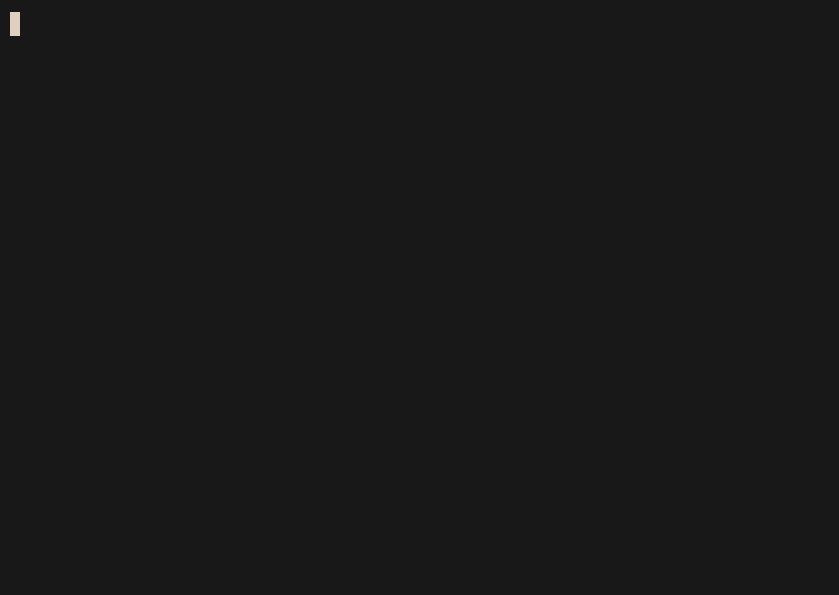
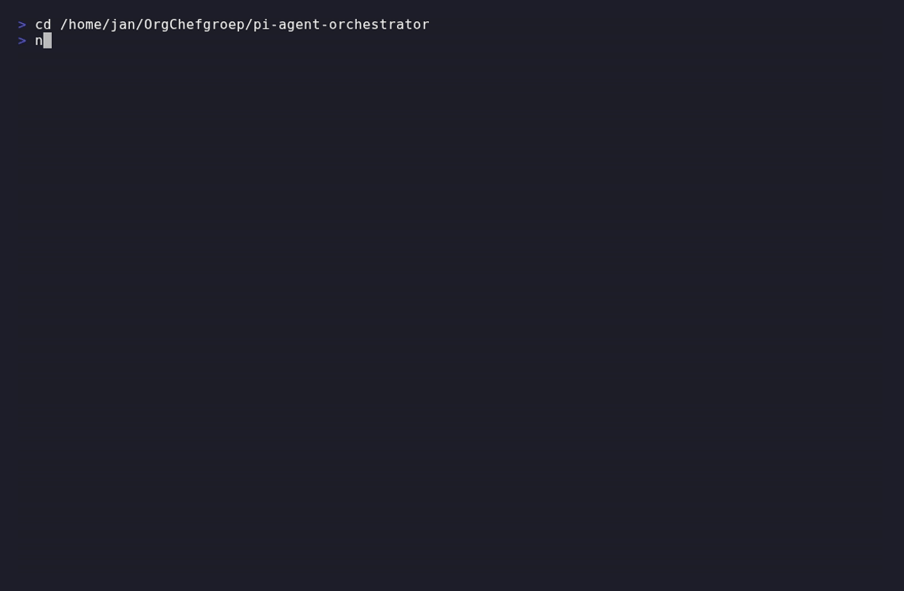

# // PI AGENT ORCHESTRATOR




**AUTONOMOUS SUB-AGENTS. TUI DASHBOARD. SWARM COORDINATION.**


Bring autonomous sub-agents to Pi. Spawn specialized agents, enforce strict budgets, execute structured handoffs, and manage agent swarms. All monitored through a high-density, interactive TUI dashboard. 

**STATUS:** ACTIVE
**VERSION:** 0.11.0
**RUNTIME:** Node.js >= 22
**HOST:** pi >= 0.70.5
**LICENSE:** MIT

---

## // INSTALLATION

Execute the following command to install the extension into the Pi environment:

```bash
pi install npm:@onlinechefgroep/pi-agent-orchestrator
```

---

## // FEATURES AND SPECIFICATIONS

| Capability | Technical Description |
|---|---|
| **Autonomous Sub-agents** | Spawn specialized agents (Explore, Plan, Analysis) operating independently to return structured outputs. |
| **Interactive Dashboard** | High-density TUI accessible via `/agents top`. Vim-style hotkeys (`j/k/Enter/K/?`), virtual scrolling, multi-select, live resource stats, and activity heatmaps. |
| **Swarm Mode** | Live `SwarmCoordinator`. Dynamic join/leave operations. Collaborative multi-agent processing (`w` hotkey). |
| **Execution Budgets** | Strict depth limiting (`levelLimit`, default: 5). Bounded concurrent tasks via `taskBudget`. |
| **Adversarial Validation** | Post-completion `Promise.all` validation with deterministic pass/fail states. |
| **Structured Handoff** | Machine-parseable JSON chain-of-agents. Graceful degradation on malformed sequences. |
| **Hook System** | 11 lifecycle event types (spawn, complete, error). 5s execution timeout. Fail-open architecture. |
| **Permission Inheritance** | Directional parent→child tool restriction. Read-only parents yield strictly read-only children. |
| **Partitioned State** | Isolated tool/skill subsets per partition. Zero cross-contamination guarantees. |
| **Deferred Context** | Boundary-level context construction. Token efficiency yields 15-48% savings on queued operations. |
| **Dual-phase Compaction** | Aggressive pruning of legacy tool outputs. Per-agent memory limits (default retention: 5 turns). |
| **Scheduling Engine** | Cron/interval/one-shot jobs. File-backed persistence via `.pi/subagent-schedules/`. |
| **Context-mode Sandbox** | Optional `ctx_*` sandbox injection via `@onlinechef/context-mode` peer dependency. |
| **Cinematic TUI** | Optional visual sidecar via `@onlinechefgroep/pi-subagents-tui`. |

---

## // BUILT-IN AGENT TYPES

| Class | Function | Authorized Tools | Context-Mode |
|---|---|---|---|
| `general-purpose` | Universal execution for complex procedures | All built-in | Opt-in |
| `Explore` | High-speed read-only structural analysis | read, bash, grep, find, ls | No |
| `Plan` | Implementation planning and architectural design | read, bash, grep, find, ls | No |
| `Analysis` | Data processing with sandboxed execution | read, bash, grep, find, ls | Yes |

---

## // CUSTOM AGENT PROFILES

Define project-level overrides in `.pi/agents/<name>.md`. Global definitions reside in `~/.pi/agent/agents/`. Project definitions take strict precedence.

### Example Profile: `security-auditor.md`

```markdown
---
display_name: "Security Auditor"
description: "Audit code for common security issues"
tools: read, grep, find
model: anthropic/claude-sonnet-4-5-20250901
extensions: false
skills: false
max_turns: 20
---
You are a security auditor. Review the provided code for:
- SQL injection
- XSS vulnerabilities
- Path traversal
- Hardcoded secrets

Output findings as a markdown list with severity (Critical / High / Medium / Low) and suggested fix.
```

### Example: Token-Optimized Agent

Use `prompt_compression` to control prompt verbosity per agent. Set to `aggressive` for background agents where token savings matter more than detailed instructions:

```markdown
---
display_name: "Quick Scanner"
description: "Fast read-only scan with minimal prompt overhead"
tools: read, grep, find
prompt_compression: aggressive
run_in_background: true
---
Scan the codebase for TODO comments and report a summary.
```

Or set to `minimal` when maximum instruction quality is critical:

```markdown
---
display_name: "Code Reviewer"
description: "Thorough code review with detailed instructions"
tools: read, grep, find
handoff: true
prompt_compression: minimal
---
Perform a thorough code review of the provided diff.
```

Per-agent `prompt_compression` overrides the global `subagents.promptCompressionLevel` setting. See [docs/api-reference.md](docs/api-reference.md) for the full level comparison table.

### Example: Chain-of-Agents Workflow

Use `handoff: true` to create agent chains where one agent's structured output feeds into the next. Here's a researcher → implementer pipeline:

**Step 1 — Research Agent** (produces handoff JSON):

```markdown
---
display_name: "Researcher"
description: "Read-only researcher that produces structured handoff"
tools: read, grep, find
handoff: true
---

Investigate the codebase and produce a structured handoff JSON with:
- "task": what needs to be done
- "files": affected file paths
- "approach": recommended implementation strategy
- "evidence": code snippets supporting the approach

End your response with the handoff JSON as the last message.
```

**Step 2 — Implementer Agent** (consumes handoff):

```markdown
---
display_name: "Implementer"
description: "Implements changes from researcher handoff"
tools: read, write, edit, bash
inherit_context: true
---

You receive a structured handoff from a researcher. Implement the changes described in the handoff's "task" field, following the "approach" strategy. Use the "files" list to locate code. Validate your implementation compiles.
```

Spawn the chain: `@Researcher investigate the auth middleware` → researcher produces handoff → `@Implementer` receives it and executes.

See [`examples/agents/handoff-chain-researcher.md`](examples/agents/handoff-chain-researcher.md) and [`examples/agents/handoff-chain-implementer.md`](examples/agents/handoff-chain-implementer.md) for complete working examples.

### Frontmatter Schema

| Directive | Type | Default | Operational Definition |
|---|---|---|---|
| `display_name` | string | filename | Interface identification string |
| `description` | string | filename | Short telemetry description |
| `tools` | CSV / `none` | all | Authorized tool subset |
| `disallowed_tools` | CSV | null | Explicit tool denial list |
| `extensions` | bool / CSV | `true` | Extension access flag |
| `skills` | bool / CSV | `true` | Skill module access flag |
| `model` | string | host default | Model identifier override |
| `thinking` | string | null | Inference effort directive |
| `max_turns` | number | null | Hard execution turn limit |
| `prompt_mode` | `replace` / `append` | `replace` | System prompt integration strategy |
| `inherit_context` | boolean | null | Parent conversation context transmission |
| `run_in_background` | boolean | null | Non-blocking execution flag |
| `isolated` | boolean | null | Strict context isolation |
| `memory` | `user` / `project` / `local` | null | State persistence scope |
| `isolation` | `worktree` | null | Physical directory isolation |
| `handoff` | boolean | null | Produce structured JSON handoff at end of response |
| `prompt_compression` | `minimal` / `balanced` / `aggressive` | (global setting) | Per-agent prompt compression override |
| `enabled` | boolean | `true` | Profile activation state |

---

## // SHOWCASE (v0.11.0 TUI)

Four pipelines (programmatic, live asciinema, Remotion hero, VHS). See [docs/SHOWCASE.md](docs/SHOWCASE.md).

| View | Demo |
|------|------|
| **Dashboard** (swarms, running cards, `?` help) |  |
| **Top view** (`t` / `l` sort) |  |
| **Agent widget** (heatmap) |  |
| **Live terminal** (asciinema capture) |  |
| **VHS** (install + demo tape) |  |

**Hero video (Remotion when available, else programmatic):**

<video src="docs/images/dashboard_preview.mp4" controls width="100%"></video>

```bash
npm run showcase              # all four: C + A + B + D
npm run showcase:ci           # CI-safe only
SKIP_REMOTION=1 npm run showcase   # skip Remotion render
```

---

## // CINEMATIC DASHBOARD (TUI SIDECAR)

The cinematic dashboard provides real-time telemetry rendering via an independent Go Bubble Tea application. It features real-time resource utilization, agent status heatmaps, and smooth virtual scrolling.


### Sidecar Installation

Package identifier: `@onlinechefgroep/pi-subagents-tui`

1. Execute: `pi install npm:@onlinechefgroep/pi-subagents-tui`
2. Configure parameter: `subagents.uiStyle = "cinematic"`

Degrades gracefully to the standard terminal display if the sidecar is absent.

### Source Compilation

```bash
git clone https://github.com/OnlineChefGroep/pi-subagents-tui.git
cd pi-subagents-tui
go build -o cinematic-tui .
```

---

## // CONFIGURATION PARAMETERS

Manage via `pi settings` CLI or direct configuration injection.

| Parameter | Default | Function |
|---|---|---|
| `subagents.defaultMaxTurns` | `0` (unlimited) | Maximum turns per agent (`0` = unlimited) |
| `subagents.maxConcurrent` | `4` | Maximum concurrently running agents |
| `subagents.orchestrationMode` | `auto` | Execution topology: `auto`, `single`, `swarm`, `crew` |
| `subagents.dashboardRefreshInterval` | `750` | Dashboard refresh interval in ms (min 100, max 60000) |
| `subagents.maxAgentsPerSession` | — | Optional hard cap on total agents spawned per session |
| `subagents.maxTotalTurnsPerSession` | — | Optional hard cap on cumulative turns across the session |
| `subagents.graceTurns` | `5` | Wrap-up turns before forced termination |
| `subagents.defaultJoinMode` | `smart` | Agent join topology: `async`, `group`, `smart`, `swarm` |
| `subagents.animationStyle` | `"braille"` | Spinner style: `braille`, `dots`, `lines`, `classic`, `none` |
| `subagents.uiStyle` | `"premium"` | UI theme: `premium`, `retro`, `plain`, `cinematic` |
| `subagents.sessionMaxSpawns` | — | Guardrail: max agents spawned per session |
| `subagents.sessionMaxTurns` | — | Guardrail: max cumulative turns per session |
| `subagents.showActivityStream` | `true` | Show real-time activity stream in widget |
| `subagents.showTokenUsage` | `true` | Show token usage and context fill percentage |
| `subagents.showTurnProgress` | `true` | Show turn progress (current/max) for running agents |
| `subagents.promptCompressionLevel` | `"balanced"` | Prompt verbosity: `minimal` (max quality), `balanced`, `aggressive` (max savings, −44% tokens) |

---

## // SYSTEM ARCHITECTURE


```text
pi host
  └── pi-agent-orchestrator
        ├── AgentRegistry (defaults + filesystem overrides)
        ├── AgentDashboard (live telemetry, vim navigation)
        ├── AgentRunner (spawn → execute → handoff → validate)
        ├── SwarmCoordinator (cluster topology management)
        ├── ScheduleStore (file-backed persistence, proper-lockfile atomic locks)
        ├── Hooks (lifecycle events)
        └── PartitionedState (strict tool isolation boundaries)

[Optional] pi-subagents-tui sidecar
        └── Go Bubble Tea executable
```

---

## // DEVELOPMENT OPERATIONS

```bash
npm install     # Fetch dependencies
npm run typecheck # Static analysis
npm test        # Run verification suite
npm run lint    # Code style enforcement
```

---

## // HOTKEYS

| Key | Operation |
|---|---|
| `j` / `↓` | Cursor down |
| `k` / `↑` | Cursor up |
| `Enter` | Intervene / steer agent |
| `K` | Terminate process |
| `v` | Visual selection mode |
| `p` | Inspect permission matrix |
| `w` | Inspect swarm topology |
| `?` | Show overlay documentation |
| `q` | Exit interface |

---

## // REFERENCE MATERIAL

- **Changelog**: [CHANGELOG.md](CHANGELOG.md)
- **Security Audit**: [SECURITY_AUDIT_REPORT.md](docs/SECURITY_AUDIT_REPORT.md)
- **Mitigation Verification**: [SECURITY_AUDIT_VERIFICATION_2026-05-23.md](docs/SECURITY_AUDIT_VERIFICATION_2026-05-23.md)

**LICENSE:** MIT — OnlineChef

