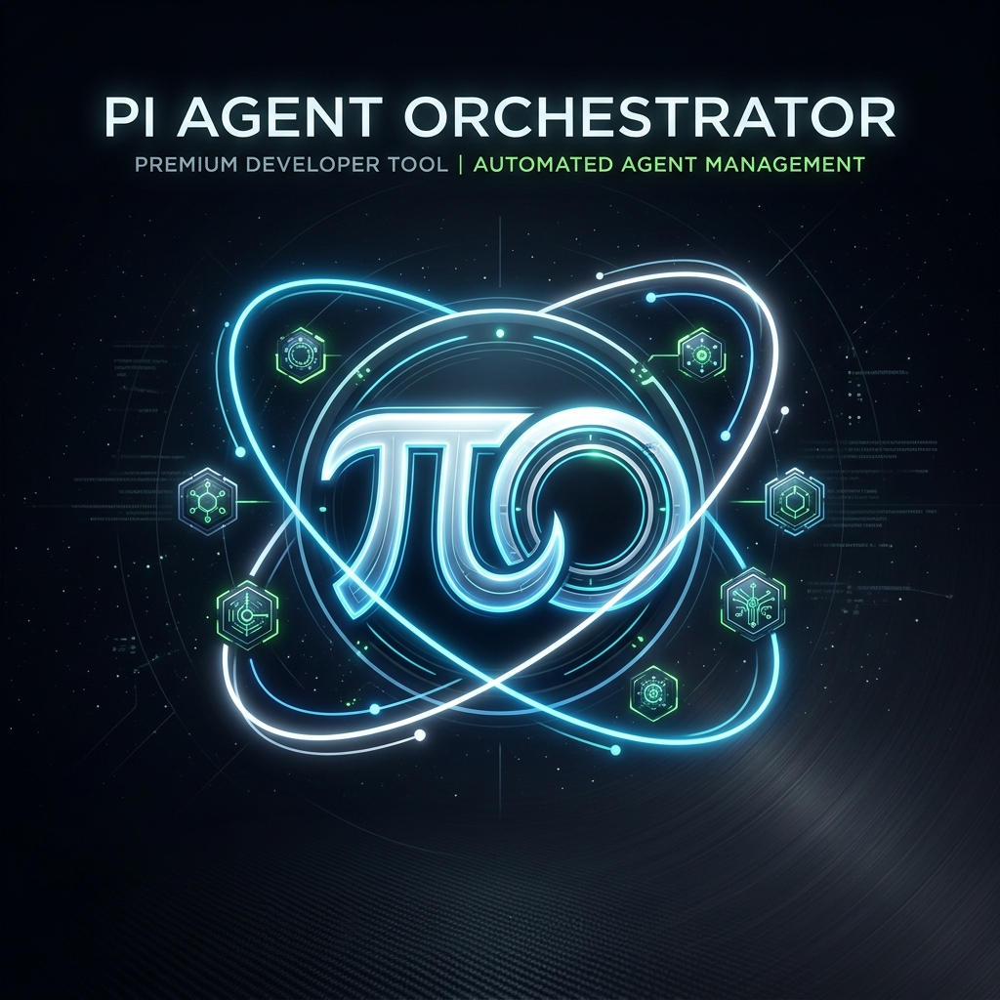
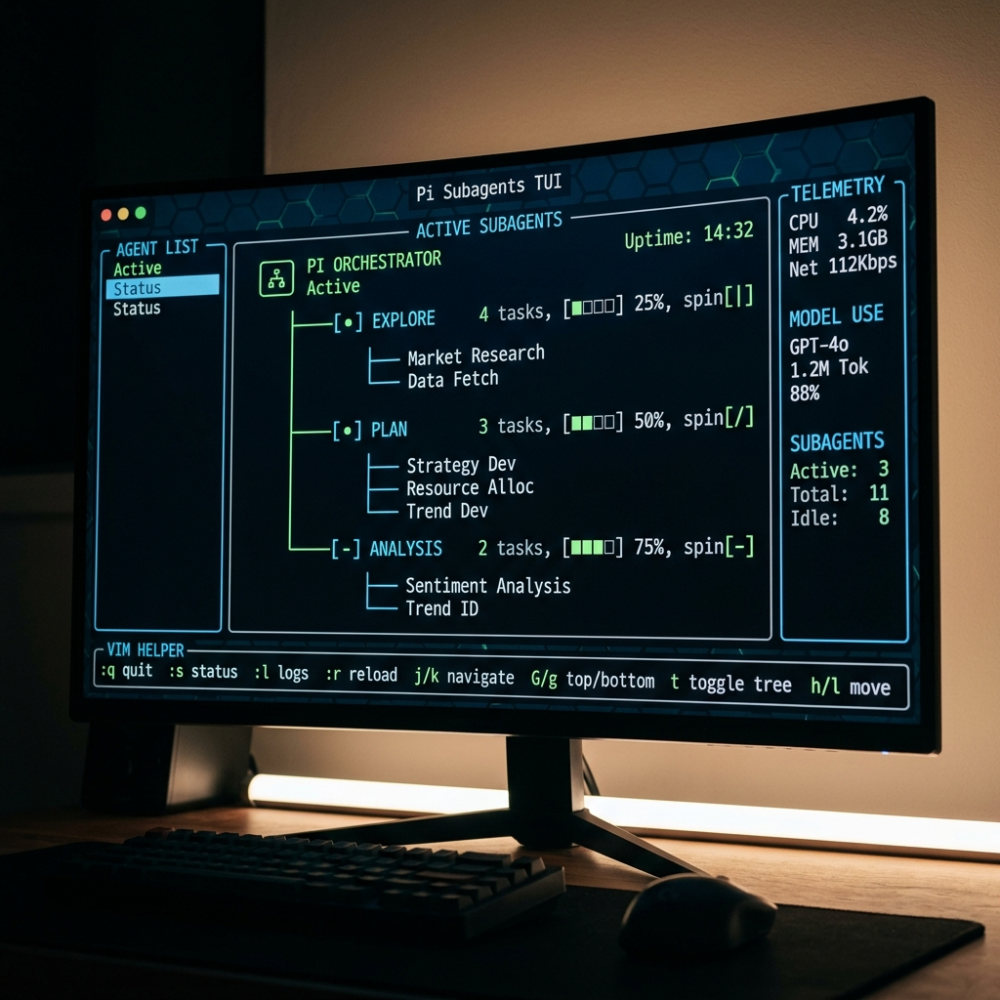
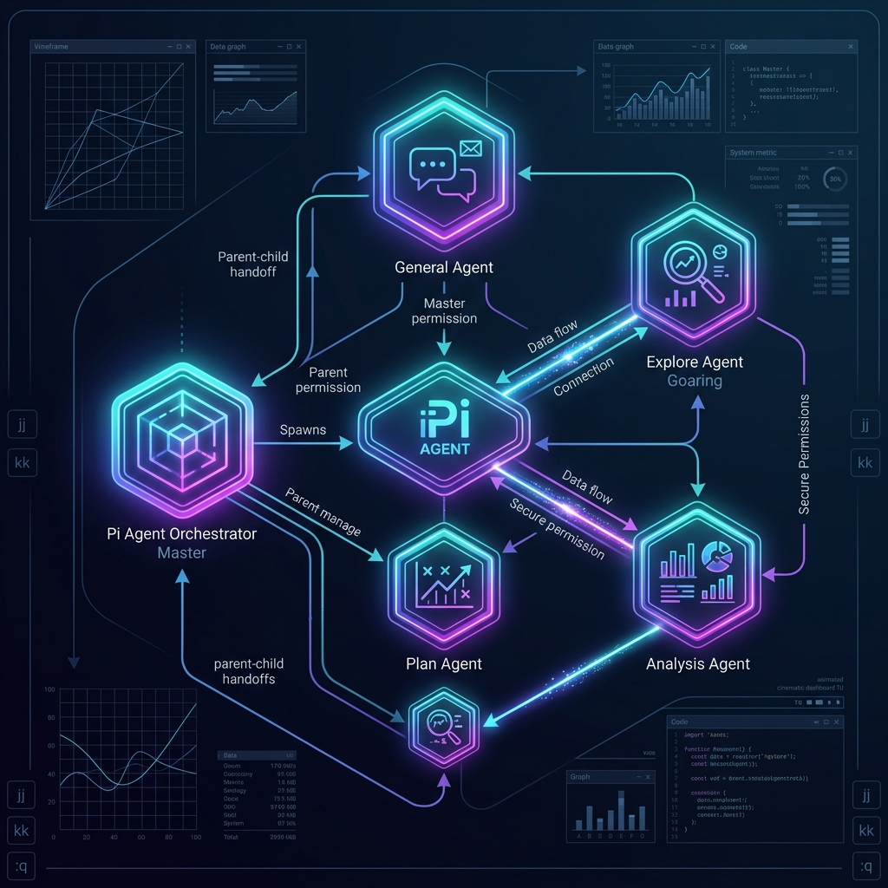

<div align="center">



# 🤖 @onlinechefgroep/pi-agent-orchestrator

**Autonomous sub-agents + cinematic TUI dashboard + swarm coordination for the Pi coding agent**

---

</div>

Bring Claude Code-style autonomous sub-agents to Pi. Spawn specialized agents, enforce budgets, chain them with structured handoffs, swarm agents together, and watch a rich interactive TUI dashboard render their progress in real time.

[](https://github.com/OnlineChefGroep/pi-agent-orchestrator)
[](https://www.typescriptlang.org/)
[](LICENSE)
[](https://github.com/OnlineChefGroep/pi-agent-orchestrator/releases)

---

## Install

```bash
pi install npm:@onlinechefgroep/pi-agent-orchestrator
```

Requires Node.js >= 22 and pi >= 0.70.5.

---

## Features

| Feature | Description |
|---------|-------------|
| **Autonomous sub-agents** | Spawn specialized agents (Explore, Plan, Analysis) that run independently and return structured results |
| **Rich interactive dashboard** | Vim-style hotkeys (`j/k/Enter/K/?`), multi-select, bulk kill, permissions view, spinners |
| **Swarm mode** | Live SwarmCoordinator with dynamic join/leave, collaborative multi-agent swarms, `w` hotkey |
| **Task budget & depth limiting** | Prevent runaway agent trees with configurable `levelLimit` (default 5) and `taskBudget` |
| **Adversarial validators** | Post-completion `Promise.all` validation with pass/fail indicators |
| **Structured handoff protocol** | JSON machine-parseable chain-of-agents with graceful degrade on malformed data |
| **Hook system** | 11 lifecycle event types (spawn, complete, error, etc.) with 5s timeout, fail-open |
| **Permission inheritance** | Directional parent→child tool restriction — a read-only parent forces a read-only child |
| **Partitioned agent state** | Isolated tool/skill subsets per partition — no cross-contamination |
| **Deferred context engine** | Build context at session boundary, saving 15-48% tokens on queued agents |
| **Dual-phase compaction** | Prune old tool outputs + per-agent memory limits (default keep 5 turns) |
| **Scheduling** | Cron/interval/one-shot recurring agent jobs with file-backed persistence |
| **Context-mode sandbox** | Optional `ctx_*` sandbox tool injection via `@onlinechef/context-mode` peer dependency |
| **Cinematic TUI dashboard** | Optional rich visual sidecar via `@onlinechefgroep/pi-subagents-tui` |

---

## Built-in Agent Types

| Type | Description | Tools | Context-mode |
|------|-------------|-------|-------------|
| `general-purpose` | All-rounder for complex multi-step tasks | all built-in | opt-in |
| `Explore` | Fast read-only codebase exploration | read, bash, grep, find, ls | no |
| `Plan` | Software architect and implementation planner | read, bash, grep, find, ls | no |
| `Analysis` | Data analysis with sandboxed code execution | read, bash, grep, find, ls | yes |

---

## Custom Agents

Create `.pi/agents/<name>.md` in your project (or globally in `~/.pi/agent/agents/`). Project-level agents override global ones.

### Example: `.pi/agents/security-auditor.md`

```markdown
---
display_name: "Security Auditor"
description: "Audit code for common security issues"
tools: read, grep, find
model: anthropic/claude-sonnet-4-5-20250901
extensions: false
skills: false
max_turns: 20
---
You are a security auditor. Review the provided code for:
- SQL injection
- XSS vulnerabilities
- Path traversal
- Hardcoded secrets

Output findings as a markdown list with severity (Critical / High / Medium / Low) and suggested fix.
```

### Frontmatter reference

| Field | Type | Default | Description |
|-------|------|---------|-------------|
| `display_name` | string | agent name | Human-readable name |
| `description` | string | agent name | Short description shown in UI |
| `tools` | CSV or `none` | all built-in | Allowed tools |
| `disallowed_tools` | CSV | — | Explicitly forbidden tools |
| `extensions` | `true` / `false` / CSV | `true` | Extension access |
| `skills` | `true` / `false` / CSV | `true` | Skill access |
| `model` | string | (host default) | LLM model override |
| `thinking` | string | — | Thinking level hint |
| `max_turns` | number | — | Turn limit |
| `prompt_mode` | `"replace"` / `"append"` | `"replace"` | How system prompt is applied |
| `inherit_context` | boolean | — | Inherit parent conversation context |
| `run_in_background` | boolean | — | Run without blocking parent |
| `isolated` | boolean | — | Run in isolated context |
| `memory` | `"user"` / `"project"` / `"local"` | — | Memory scope |
| `isolation` | `"worktree"` | — | Worktree isolation |
| `enabled` | boolean | `true` | Enable/disable this agent |

---

## Cinematic Dashboard (TUI Sidecar)

The cinematic dashboard is an **optional** Go Bubble Tea application that renders agent status in real time with animated backgrounds.



### Installation

The TUI sidecar is now a separate package: **[@onlinechefgroep/pi-subagents-tui](https://github.com/OnlineChefGroep/pi-subagents-tui)**

To enable cinematic mode:

1. Install the TUI package: `pi install npm:@onlinechefgroep/pi-subagents-tui`
2. Set `subagents.cinematic.uiStyle` to `"cinematic"` in settings

Without the TUI package installed, cinematic mode will gracefully fall back to the standard TUI display.

### Manual Build

If you prefer to build from source:

```bash
git clone https://github.com/OnlineChefGroep/pi-subagents-tui.git
cd pi-subagents-tui
go build -o cinematic-tui .
```

---

## Configuration

Settings are managed via pi's settings UI or `pi settings` CLI:

| Setting | Default | Description |
|---------|---------|-------------|
| `subagents.levelLimit` | `5` | Maximum depth of agent tree |
| `subagents.taskBudget` | `unlimited` | Max concurrent tasks |
| `subagents.orchestrationMode` | `spawn` | Default orchestration: `spawn`, `parallel`, or `sequential` |
| `subagents.dashboardRefreshInterval` | `5000` | Dashboard refresh interval in ms |
| `subagents.compaction.keepTurns` | `5` | Memory turns to retain per agent |
| `subagents.deferredContext` | `true` | Build context at session boundary |
| `subagents.validators.enabled` | `true` | Run adversarial validators |
| `subagents.swarm.enabled` | `true` | Enable swarm mode |
| `subagents.cinematic.animation` | `"smooth"` | TUI animation style |
| `subagents.cinematic.uiStyle` | `"dark"` | TUI color theme |

---

## Architecture



```
pi host
  └── pi-agent-orchestrator extension
        ├── AgentRegistry (defaults + custom .md agents)
        ├── AgentDashboard (live TUI with vim hotkeys, swarm view)
        ├── AgentRunner (spawn → execute → handoff → validate)
        ├── SwarmCoordinator (live join/leave, collaborative swarms)
        ├── ScheduleStore (file-backed persistence, PID-locked)
        ├── Hooks (lifecycle events)
        └── PartitionedState (isolated tool/skill subsets)

[Optional] pi-subagents-tui sidecar
        └── Go Bubble Tea cinematic dashboard
```

---

## Development

```bash
# Install dependencies
npm install

# Typecheck
npm run typecheck

# Run tests
npm test

# Lint
npm run lint
```

---

## Hotkeys (AgentDashboard)

| Key | Action |
|-----|--------|
| `j` / `↓` | Move selection down |
| `k` / `↑` | Move selection up |
| `Enter` | Steer selected agent |
| `K` | Kill selected agent |
| `v` | Visual mode (multi-select) |
| `p` | Toggle permissions view |
| `w` | Toggle swarm view |
| `?` | Show help overlay |
| `q` | Close dashboard / quit view |

---

## Changelog

See [CHANGELOG.md](CHANGELOG.md) for version history.

---

## Security

See [SECURITY_AUDIT_REPORT.md](SECURITY_AUDIT_REPORT.md) and [SECURITY_AUDIT_VERIFICATION_2026-05-23.md](SECURITY_AUDIT_VERIFICATION_2026-05-23.md) for detailed findings and mitigations.

---

## License

MIT — [OnlineChef](https://github.com/OnlineChef)
