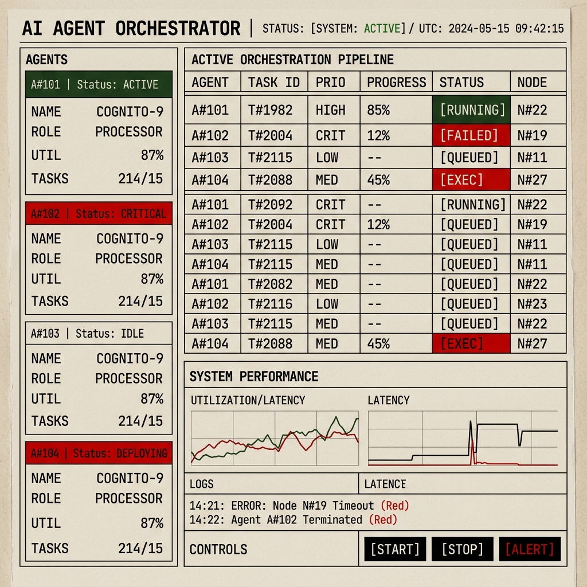

# // PI AGENT ORCHESTRATOR




**AUTONOMOUS SUB-AGENTS. TUI DASHBOARD. SWARM COORDINATION.**


Bring autonomous sub-agents to Pi. Spawn specialized agents, enforce strict budgets, execute structured handoffs, and manage agent swarms. All monitored through a high-density, interactive TUI dashboard. 

**STATUS:** ACTIVE
**VERSION:** 0.10.1
**RUNTIME:** Node.js >= 22
**HOST:** pi >= 0.70.5
**LICENSE:** MIT

---

## // INSTALLATION

Execute the following command to install the extension into the Pi environment:

```bash
pi install npm:@onlinechefgroep/pi-agent-orchestrator
```

---

## // FEATURES AND SPECIFICATIONS

| Capability | Technical Description |
|---|---|
| **Autonomous Sub-agents** | Spawn specialized agents (Explore, Plan, Analysis) operating independently to return structured outputs. |
| **Interactive Dashboard** | High-density TUI. Vim-style hotkeys (`j/k/Enter/K/?`), multi-select, bulk termination, permission inspection. |
| **Swarm Mode** | Live `SwarmCoordinator`. Dynamic join/leave operations. Collaborative multi-agent processing (`w` hotkey). |
| **Execution Budgets** | Strict depth limiting (`levelLimit`, default: 5). Bounded concurrent tasks via `taskBudget`. |
| **Adversarial Validation** | Post-completion `Promise.all` validation with deterministic pass/fail states. |
| **Structured Handoff** | Machine-parseable JSON chain-of-agents. Graceful degradation on malformed sequences. |
| **Hook System** | 11 lifecycle event types (spawn, complete, error). 5s execution timeout. Fail-open architecture. |
| **Permission Inheritance** | Directional parent→child tool restriction. Read-only parents yield strictly read-only children. |
| **Partitioned State** | Isolated tool/skill subsets per partition. Zero cross-contamination guarantees. |
| **Deferred Context** | Boundary-level context construction. Token efficiency yields 15-48% savings on queued operations. |
| **Dual-phase Compaction** | Aggressive pruning of legacy tool outputs. Per-agent memory limits (default retention: 5 turns). |
| **Scheduling Engine** | Cron/interval/one-shot jobs. File-backed persistence via `.pi/subagent-schedules/`. |
| **Context-mode Sandbox** | Optional `ctx_*` sandbox injection via `@onlinechef/context-mode` peer dependency. |
| **Cinematic TUI** | Optional visual sidecar via `@onlinechefgroep/pi-subagents-tui`. |

---

## // BUILT-IN AGENT TYPES

| Class | Function | Authorized Tools | Context-Mode |
|---|---|---|---|
| `general-purpose` | Universal execution for complex procedures | All built-in | Opt-in |
| `Explore` | High-speed read-only structural analysis | read, bash, grep, find, ls | No |
| `Plan` | Implementation planning and architectural design | read, bash, grep, find, ls | No |
| `Analysis` | Data processing with sandboxed execution | read, bash, grep, find, ls | Yes |

---

## // CUSTOM AGENT PROFILES

Define project-level overrides in `.pi/agents/<name>.md`. Global definitions reside in `~/.pi/agent/agents/`. Project definitions take strict precedence.

### Example Profile: `security-auditor.md`

```markdown
---
display_name: "Security Auditor"
description: "Audit code for common security issues"
tools: read, grep, find
model: anthropic/claude-sonnet-4-5-20250901
extensions: false
skills: false
max_turns: 20
---
You are a security auditor. Review the provided code for:
- SQL injection
- XSS vulnerabilities
- Path traversal
- Hardcoded secrets

Output findings as a markdown list with severity (Critical / High / Medium / Low) and suggested fix.
```

### Frontmatter Schema

| Directive | Type | Default | Operational Definition |
|---|---|---|---|
| `display_name` | string | filename | Interface identification string |
| `description` | string | filename | Short telemetry description |
| `tools` | CSV / `none` | all | Authorized tool subset |
| `disallowed_tools` | CSV | null | Explicit tool denial list |
| `extensions` | bool / CSV | `true` | Extension access flag |
| `skills` | bool / CSV | `true` | Skill module access flag |
| `model` | string | host default | Model identifier override |
| `thinking` | string | null | Inference effort directive |
| `max_turns` | number | null | Hard execution turn limit |
| `prompt_mode` | `replace` / `append` | `replace` | System prompt integration strategy |
| `inherit_context` | boolean | null | Parent conversation context transmission |
| `run_in_background` | boolean | null | Non-blocking execution flag |
| `isolated` | boolean | null | Strict context isolation |
| `memory` | `user` / `project` / `local` | null | State persistence scope |
| `isolation` | `worktree` | null | Physical directory isolation |
| `enabled` | boolean | `true` | Profile activation state |

---

## // CINEMATIC DASHBOARD (TUI SIDECAR)

The cinematic dashboard provides real-time telemetry rendering via an independent Go Bubble Tea application.


### Sidecar Installation

Package identifier: `@onlinechefgroep/pi-subagents-tui`

1. Execute: `pi install npm:@onlinechefgroep/pi-subagents-tui`
2. Configure parameter: `subagents.cinematic.uiStyle = "cinematic"`

Degrades gracefully to the standard terminal display if the sidecar is absent.

### Source Compilation

```bash
git clone https://github.com/OnlineChefGroep/pi-subagents-tui.git
cd pi-subagents-tui
go build -o cinematic-tui .
```

---

## // CONFIGURATION PARAMETERS

Manage via `pi settings` CLI or direct configuration injection.

| Parameter | Default | Function |
|---|---|---|
| `subagents.levelLimit` | `5` | Absolute depth ceiling for agent hierarchies |
| `subagents.taskBudget` | `unlimited` | Concurrent execution limit |
| `subagents.orchestrationMode` | `spawn` | Default topology: `spawn`, `parallel`, `sequential` |
| `subagents.dashboardRefreshInterval` | `5000` | Telemetry refresh rate (ms) |
| `subagents.compaction.keepTurns` | `5` | Memory retention limit per agent |
| `subagents.deferredContext` | `true` | Lazy boundary context compilation |
| `subagents.validators.enabled` | `true` | Adversarial validation enforcement |
| `subagents.swarm.enabled` | `true` | Swarm mode activation |
| `subagents.cinematic.animation` | `"smooth"` | TUI render mode |
| `subagents.cinematic.uiStyle` | `"dark"` | TUI visual theme |

---

## // SYSTEM ARCHITECTURE


```text
pi host
  └── pi-agent-orchestrator
        ├── AgentRegistry (defaults + filesystem overrides)
        ├── AgentDashboard (live telemetry, vim navigation)
        ├── AgentRunner (spawn → execute → handoff → validate)
        ├── SwarmCoordinator (cluster topology management)
        ├── ScheduleStore (file-backed persistence, PID locks)
        ├── Hooks (lifecycle events)
        └── PartitionedState (strict tool isolation boundaries)

[Optional] pi-subagents-tui sidecar
        └── Go Bubble Tea executable
```

---

## // DEVELOPMENT OPERATIONS

```bash
npm install     # Fetch dependencies
npm run typecheck # Static analysis
npm test        # Run verification suite
npm run lint    # Code style enforcement
```

---

## // HOTKEYS

| Key | Operation |
|---|---|
| `j` / `↓` | Cursor down |
| `k` / `↑` | Cursor up |
| `Enter` | Intervene / steer agent |
| `K` | Terminate process |
| `v` | Visual selection mode |
| `p` | Inspect permission matrix |
| `w` | Inspect swarm topology |
| `?` | Show overlay documentation |
| `q` | Exit interface |

---

## // REFERENCE MATERIAL

- **Changelog**: [CHANGELOG.md](CHANGELOG.md)
- **Security Audit**: [SECURITY_AUDIT_REPORT.md](docs/SECURITY_AUDIT_REPORT.md)
- **Mitigation Verification**: [SECURITY_AUDIT_VERIFICATION_2026-05-23.md](docs/SECURITY_AUDIT_VERIFICATION_2026-05-23.md)

**LICENSE:** MIT — OnlineChef

