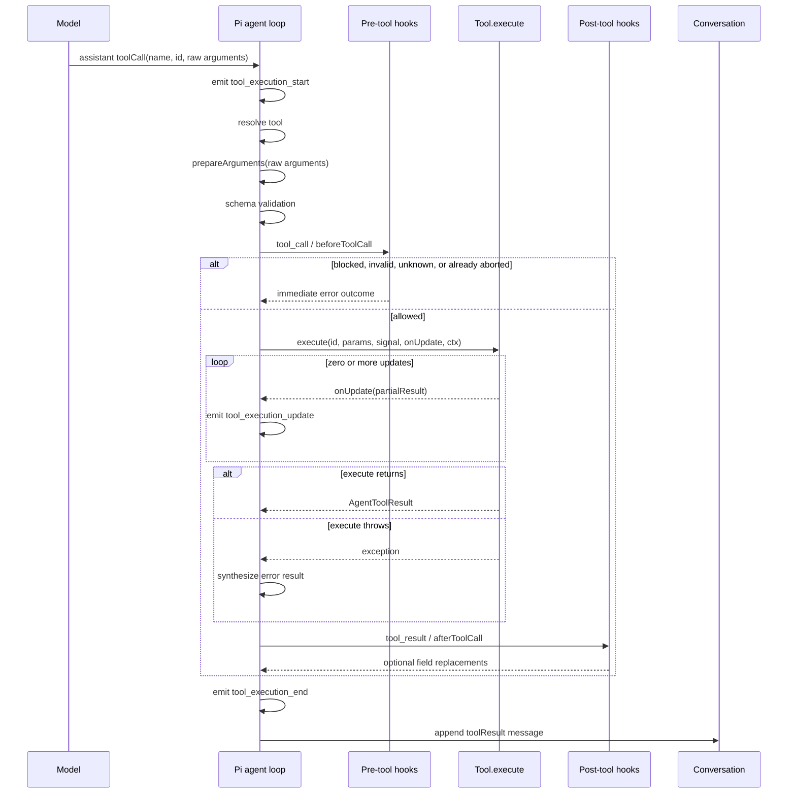
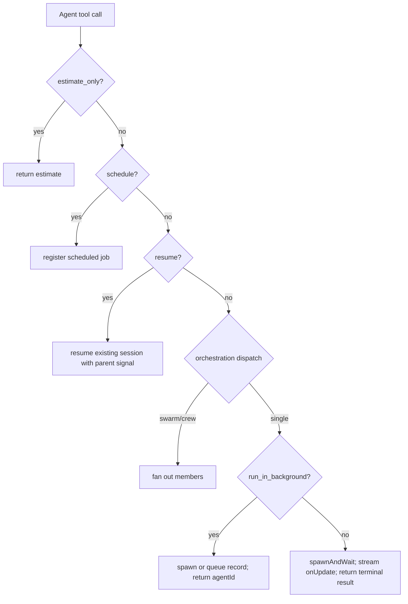
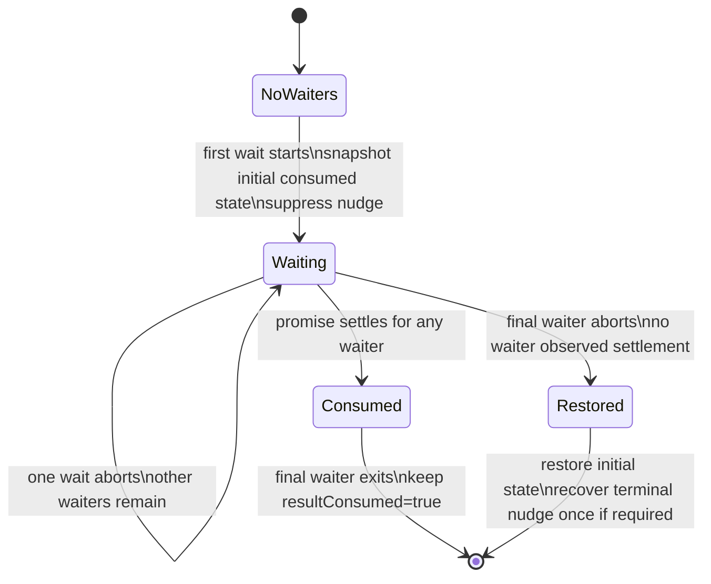
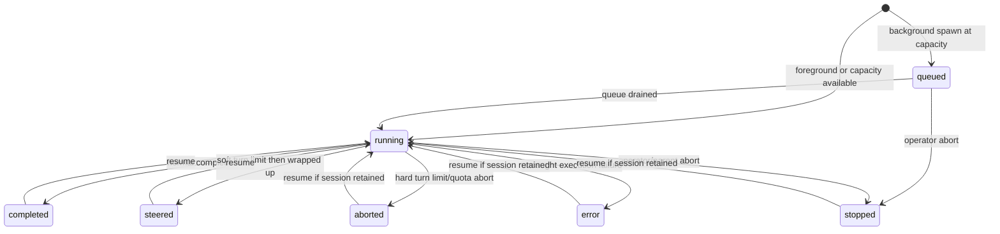
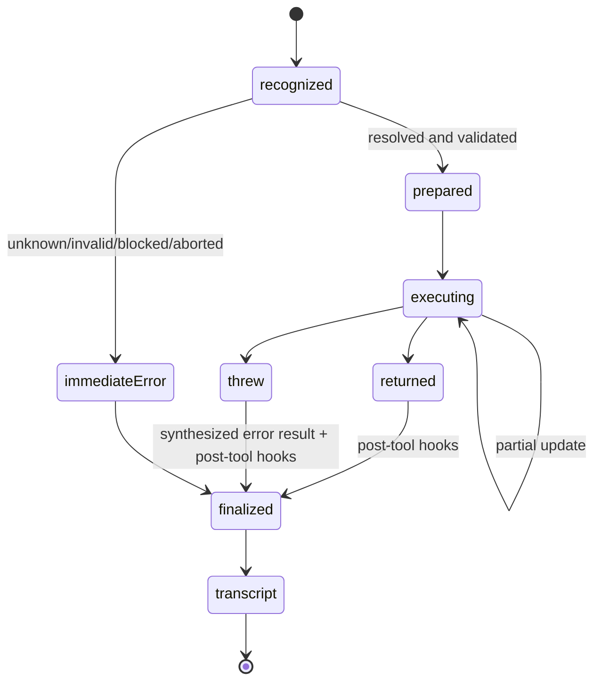

# Tool Calling and Tool Execution Contract

> **Status:** Normative implementation reference for `@onlinechefgroep/pi-agent-orchestrator`.
> **Applies to:** the supported Pi host (`@earendil-works/pi-coding-agent >= 0.80.10`) and this repository's `Agent`, `get_subagent_result`, and `steer_subagent` tools.
> **Audience:** extension authors, orchestrator maintainers, agent-profile authors, reviewers, and operators debugging a blocked or unresponsive run.

This document defines what a tool call is, how Pi turns model output into an execution, how cancellation and steering interact with a running tool, and which concurrency invariants the orchestrator must preserve. It is the canonical reference for tool-call behavior in this repository.

---

## 1. Executive contract

A tool call is not a function call made directly by the model. It is a structured request emitted in an assistant message. Pi owns the execution boundary:

1. The model emits one or more `toolCall` content blocks.
2. Pi resolves each tool by name.
3. Raw arguments may pass through `prepareArguments`.
4. Pi validates the resulting arguments against the tool's TypeBox schema.
5. Pre-execution hooks may inspect, mutate, block, or reject the call.
6. Pi invokes `execute(toolCallId, params, signal, onUpdate, ctx)`.
7. The tool may publish partial UI updates through `onUpdate`.
8. The tool either returns an `AgentToolResult` or throws.
9. Post-execution hooks may replace result fields.
10. Pi emits a `toolResult` message back into the model-visible transcript.
11. The agent either begins another model turn, consumes steering, processes a follow-up, or stops.

The critical rules are:

- `toolCallId` is the correlation key for one execution; agent IDs and session IDs are different identifiers.
- `params` are schema-validated before `execute` begins.
- `signal` is the cancellation contract. Long-running tools must honor it at every blocking boundary.
- `onUpdate` is for partial presentation and progress; it is not the final model-visible result.
- Returning a result means success. Throwing means tool failure.
- Esc cancels the current parent operation. It does not automatically mean “stop every background agent”.
- Steering is queued until the current assistant turn finishes its active tool calls. A non-cooperative tool cannot be interrupted by steering alone.
- Parallel tool calls share process state. Mutable shared state must be synchronized explicitly.
- Background result delivery is an ownership protocol: exactly one path should consume or notify a terminal result.

---

## 2. Vocabulary and identifiers

The terms below are deliberately distinct.

| Term | Meaning | Typical identifier |
| --- | --- | --- |
| Tool definition | Registered executable capability with schema, description, renderers, and `execute` | tool name, for example `Agent` |
| Tool call | Structured model request inside an assistant message | `toolCallId` |
| Tool execution | Runtime invocation of the resolved tool | same `toolCallId` |
| Tool update | Partial result emitted while execution is still active | same `toolCallId` |
| Tool result | Final content/details returned or synthesized after failure | same `toolCallId` |
| Agent record | Orchestrator-owned lifecycle state for a subagent | `agentId` |
| Agent session | Pi conversation/runtime instance used by a subagent | session identity internal to Pi |
| Parent turn | The host agent turn that issued the orchestration tool call | host session turn index |
| Background promise | Promise representing eventual subagent completion | stored on `AgentRecord.promise` |
| Steering message | User-like message injected before the subagent's next model request | no tool-call identity |
| Follow-up message | Message processed after the agent would otherwise become idle | no tool-call identity |
| Correlation ID | Stable observability identifier shared across agent/turn/tool spans | `AgentRecord.correlationId` |

Do not use `toolCallId`, `agentId`, and `correlationId` interchangeably:

- `toolCallId` correlates one model-requested tool execution.
- `agentId` addresses one orchestrated subagent record.
- `correlationId` groups telemetry across the lifetime of an agent, including resume operations.

---

## 3. Runtime layers

Tool calling crosses four layers.

```text
Provider / model
  emits AssistantMessage.content[type=toolCall]
        │
        ▼
Pi agent loop
  resolution → preparation → validation → execution → result message
        │
        ▼
Pi coding-agent extension runtime
  extension context, pre/post hooks, custom rendering, host cancellation
        │
        ▼
pi-agent-orchestrator
  AgentManager, AgentRecord, background queues, notifications, steering,
  result ownership, swarms/groups, telemetry, output transcripts
```

### 3.1 Provider layer

The provider produces structured tool-call blocks. Provider output is untrusted input. A syntactically valid block can still reference an unknown tool, contain invalid arguments, or be incomplete because model output hit a token limit.

### 3.2 Pi agent loop

Pi is responsible for:

- resolving the named tool;
- compatibility preparation;
- schema validation;
- sequential or parallel scheduling;
- propagating the abort signal;
- converting thrown exceptions into error tool results;
- emitting lifecycle events;
- appending ordered tool-result messages to the transcript.

### 3.3 Extension runtime

The coding-agent extension layer adds:

- `ExtensionContext` as the fifth `execute` argument;
- custom call/result renderers;
- `tool_call` and `tool_result` interception;
- session UI and input APIs;
- host mode and trust information;
- access to the current host abort signal.

### 3.4 Orchestrator layer

The orchestrator adds a second lifecycle around subagents:

- an `Agent` tool execution creates an `AgentRecord`;
- the manager may queue or start the record;
- a nested `AgentSession` executes its own model/tool loop;
- result retrieval and completion notifications coordinate ownership;
- `steer_subagent` injects messages into that nested session;
- the parent tool can finish while the background record continues.

This distinction explains the original blocking-wait failure mode: the parent was stuck inside one tool execution while the background subagent was healthy and still running.

---

## 4. Canonical Pi tool lifecycle

For each model-emitted tool call, the effective lifecycle is:



### 4.1 Lifecycle event meanings

| Event | Meaning | Stable fields |
| --- | --- | --- |
| `tool_execution_start` | Pi recognized a call and began preflight | `toolCallId`, `toolName`, raw `args` |
| `tool_call` | Extension pre-execution interception | `toolCallId`, `toolName`, validated/mutable `input` |
| `tool_execution_update` | Tool emitted a partial result | `toolCallId`, `toolName`, `partialResult` |
| `tool_result` | Extension post-execution interception | final `content`, `details`, `isError`, optional `usage` |
| `tool_execution_end` | Finalized execution outcome is available | `toolCallId`, `toolName`, `result`, `isError` |
| tool-result message | Model-visible transcript artifact | tool call ID, tool name, final content |

`tool_execution_start` does not prove that `execute` ran. Unknown tools, invalid arguments, blocked calls, an already-aborted signal, and truncated model output can all produce immediate error outcomes.

### 4.2 Tool-call preflight

Preflight is intentionally separate from execution:

1. Look up tool by name.
2. Apply `prepareArguments` if configured.
3. Validate against the schema.
4. Run pre-tool interception.
5. Check cancellation.
6. Either create a prepared execution or an immediate error outcome.

A `prepareArguments` function is a compatibility shim, not a general parser. It runs before validation and must return the canonical schema shape. Deprecated aliases should not remain in the public schema merely to support old callers.

### 4.3 Tool errors

Tool code must throw on failure:

```ts
throw new Error("Agent record no longer exists");
```

Do not return an ordinary text result that merely says “Error” unless the condition is an expected domain response rather than execution failure. Pi uses thrown failures to set `isError` and to construct the corresponding error tool result.

---

## 5. Tool definition contract

A Pi coding-agent extension tool has this conceptual shape:

```ts
interface ToolDefinition<TParams, TDetails, TState> {
  name: string;
  label: string;
  description: string;
  promptSnippet?: string;
  promptGuidelines?: string[];
  parameters: TParams;
  prepareArguments?: (raw: unknown) => TParams;
  executionMode?: "sequential" | "parallel";

  execute(
    toolCallId: string,
    params: TParams,
    signal: AbortSignal | undefined,
    onUpdate: ((partial: AgentToolResult<TDetails>) => void) | undefined,
    ctx: ExtensionContext,
  ): Promise<AgentToolResult<TDetails>>;

  renderCall?: (...args: unknown[]) => Component;
  renderResult?: (...args: unknown[]) => Component;
}
```

### 5.1 `name`

The exact model-facing tool identifier. It is part of the protocol. Renaming it is a breaking change for prompts, transcripts, hooks, and any integrations that invoke it by name.

Repository names are:

- `Agent`
- `get_subagent_result`
- `steer_subagent`

### 5.2 `label`

Human-readable UI text. It may change without changing the invocation protocol.

### 5.3 `description`

Model-facing behavioral contract. It must state:

- the operation;
- important preconditions;
- whether it waits or returns immediately;
- cancellation behavior;
- incompatible parameter combinations;
- what the model should do with the result.

Descriptions are execution policy, not decoration. Ambiguous descriptions produce invalid call sequences even when implementation code is correct.

### 5.4 `parameters`

The TypeBox schema is the validation boundary. Prefer:

- narrow enumerations over arbitrary strings where the value set is closed;
- explicit optional fields;
- minimum/maximum constraints for counts;
- descriptions that explain defaults and incompatibilities;
- no hidden coercion after validation.

Cross-field constraints that TypeBox cannot express must be enforced at the start of `execute` before side effects occur.

### 5.5 `executionMode`

Pi defaults to parallel tool execution. A tool may opt into `sequential` when it mutates shared process or filesystem state that cannot safely be concurrent.

Setting one tool in a batch to `sequential` causes the batch to use sequential execution. Do not set this merely because the operation is long-running. Use it when correctness requires ordering or mutual exclusion.

### 5.6 Renderers

`renderCall` and `renderResult` are presentation only. They must not become hidden lifecycle logic. An execution must remain correct in TUI, RPC, JSON, and print modes where rendering behavior differs or is absent.

---

## 6. The five `execute` arguments

### 6.1 `toolCallId`

Properties:

- unique for the model-emitted call;
- stable for call rendering, updates, result rendering, events, and transcript correlation;
- not a subagent ID;
- suitable as a map key for per-call transient state;
- unsuitable as a persistent identity across retries or resume operations.

Use it for:

- progress maps;
- event correlation;
- deduplicating updates from the same invocation;
- associating a background record with the originating parent call.

The orchestrator stores the originating tool-call ID on background records as `record.toolCallId` for grouping and UI correlation.

### 6.2 `params`

`params` have already passed schema validation. The tool may still need semantic validation, for example:

- `schedule` cannot be combined with `resume`;
- `schedule` cannot inherit a parent context that will not exist at fire time;
- `estimate_only` must not spawn or resume;
- a target `agent_id` must still exist and be in the expected state.

Validate all semantic invariants before creating files, sessions, branches, timers, or background agents.

### 6.3 `signal`

The signal represents cancellation of the current tool execution/agent operation. It can already be aborted when `execute` starts.

Minimum contract for every blocking tool:

```ts
if (signal?.aborted) {
  throw signal.reason instanceof Error
    ? signal.reason
    : new DOMException("Operation aborted", "AbortError");
}
```

Then pass or bridge the signal through every nested blocking operation:

```ts
await fetch(url, { signal });
await pi.exec("command", args, { signal });
await waitForPromiseOrAbort(record.promise, signal);
```

The signal does not cancel arbitrary JavaScript promises automatically. Code such as this is non-cancellable:

```ts
await record.promise;
```

It must explicitly race the promise with the signal and remove the abort listener after either side settles.

### 6.4 `onUpdate`

`onUpdate` streams partial `AgentToolResult` values while execution is active.

Use it for:

- progress counters;
- active tool names;
- streamed output previews;
- elapsed time;
- partial structured details used by the renderer.

Properties:

- updates are UI/runtime events, not final transcript results;
- updates after the tool promise settles are ignored;
- update callbacks may be called many times;
- update payloads should be bounded and cheap to render;
- final correctness cannot depend on the UI receiving every update.

The foreground `Agent` path uses `onUpdate` to show tool count, active activity, duration, token usage, and spinner state. Background execution returns immediately and moves observability to the persistent widget and completion notifications.

### 6.5 `ctx`

`ExtensionContext` exposes the current mode, working directory, model, session manager, UI APIs, active signal, trust state, and host control methods.

Important distinctions:

- the explicit `signal` argument belongs to this tool execution;
- `ctx.signal` is the host's current streaming signal and should normally represent the same active operation;
- `ctx.abort()` aborts the current host operation;
- `ctx.ui` may not support terminal-only interaction outside TUI mode;
- project trust must be checked before project-local executable resources are treated as trusted.

Do not retain `ctx` indefinitely as if it were a global singleton. Session switches and reloads can replace the active context.

---

## 7. Tool result contract

A final result has these fields:

```ts
interface AgentToolResult<TDetails> {
  content: Array<TextContent | ImageContent>;
  details: TDetails;
  usage?: Usage;
  addedToolNames?: string[];
  terminate?: boolean;
}
```

### 7.1 `content`

The model-visible result. Keep it:

- complete enough for the next reasoning step;
- explicit about identifiers the model needs later;
- bounded when raw output is large;
- free of UI-only decoration;
- accurate about terminal versus still-running state.

For a background spawn, `content` must return the `agentId` immediately because future `get_subagent_result` and `steer_subagent` calls depend on it.

### 7.2 `details`

Structured UI/logging payload. It may contain richer state than `content`, including:

- status;
- duration;
- tokens;
- activity;
- validation state;
- agent ID;
- renderer tags.

`details` should not be required for the model to understand the result because custom details are not the durable protocol between the tool and the model.

### 7.3 `usage`

Usage generated by the tool itself, such as a nested model invocation. It is separate from the main model request's usage accounting.

### 7.4 `terminate`

This is an early-stop hint for the current tool batch. Pi only terminates early when every finalized result in the batch sets `terminate: true`. A single terminating tool cannot silently discard sibling calls.

### 7.5 Post-tool overrides

Post-tool hooks replace fields; they do not deep-merge nested `content`, `details`, or `usage`. A hook that returns replacement content owns the entire content array.

---

## 8. Parallel and sequential calls

### 8.1 Default behavior

The Pi agent loop defaults to parallel execution unless the loop is configured sequentially or any call in the batch targets a tool whose `executionMode` is `sequential`.

Parallel mode has deliberately mixed ordering:

1. Calls are discovered in assistant-message source order.
2. `tool_execution_start` and preflight happen in source order.
3. Allowed executions run concurrently.
4. Partial updates arrive in runtime order.
5. `tool_execution_end` arrives in completion order.
6. Final tool-result messages are appended in original source order.

This gives the model a deterministic transcript while preserving runtime concurrency.

### 8.2 Consequences

Never infer transcript order from completion time. Never infer completion order from the order of final tool-result messages.

Do not correlate concurrent work by tool name alone. Multiple calls to the same tool can overlap; use `toolCallId`.

### 8.3 Shared-state hazards

Common races include:

- two calls updating one boolean ownership flag;
- two file mutations using read-modify-write without a lock;
- one cancellation restoring state captured before another call changed it;
- a completion callback publishing while a waiter is about to consume the same result;
- stale partial updates overwriting a newer renderer state;
- two calls removing the same event listener or timer.

Use one of:

- a per-call map keyed by `toolCallId`;
- a per-resource coordinator with reference counts;
- a queue/mutex for mutation;
- immutable snapshots plus compare-and-swap semantics;
- idempotent publication with a delivery token.

A shared boolean is rarely sufficient when multiple callers can claim the same resource concurrently.

---

## 9. Cancellation semantics

Cancellation has scopes. Treating all aborts as equivalent creates lost results and accidental agent termination.

| Operation | Cancellation target | Background subagent continues? |
| --- | --- | --- |
| Esc during foreground `Agent` call | parent tool and foreground subagent session | No; parent signal is wired to the subagent abort controller |
| Esc during `get_subagent_result(wait:true)` | only the blocking wait | Yes |
| `/agents` terminate / manager `abort(agentId)` | selected subagent | No |
| Turn/tool quota exceeded inside subagent | subagent session | No |
| Steering message | no cancellation by itself | Yes; message is consumed at the next steering drain point |
| Parent agent abort propagated to child spawn | child record/session | No |

### 9.1 Cancellable-promise pattern

```ts
async function waitForPromiseOrAbort<T>(
  promise: Promise<T>,
  signal?: AbortSignal,
): Promise<T> {
  if (!signal) return await promise;
  if (signal.aborted) throw abortError(signal);

  return await new Promise<T>((resolve, reject) => {
    let settled = false;

    const cleanup = () => signal.removeEventListener("abort", onAbort);
    const finish = (fn: () => void) => {
      if (settled) return;
      settled = true;
      cleanup();
      fn();
    };
    const onAbort = () => finish(() => reject(abortError(signal)));

    signal.addEventListener("abort", onAbort, { once: true });
    if (signal.aborted) return onAbort();

    promise.then(
      value => finish(() => resolve(value)),
      error => finish(() => reject(error)),
    );
  });
}
```

Required properties:

- check already-aborted signals;
- close the race between check and listener registration;
- use a once-only listener;
- remove the listener when either side settles;
- preserve `AbortError` identity;
- do not cancel the underlying operation unless that is the intended scope.

### 9.2 Cleanup

Every long-lived execution must clean up in `finally`:

- signal listeners;
- session subscriptions;
- intervals/timeouts;
- active OTel spans;
- file stream subscriptions;
- heartbeat/message polling;
- temporary ownership state.

Cancellation is a normal control path, not an exceptional excuse to skip cleanup.

### 9.3 Catching aborts

Do not turn an abort into a successful text result unless the tool's public contract explicitly defines cancellation as a normal result. Usually the correct behavior is to rethrow `AbortError` so Pi finalizes the tool as cancelled/error and releases the parent turn.

---

## 10. Steering, follow-ups, and why a running tool can block them

Pi has two message queues:

- steering: injected after the current assistant turn finishes its tool calls and before the next model request;
- follow-up: injected after the agent would otherwise stop.

### 10.1 Steering is not an interrupt signal

`session.steer(message)` queues a message. It does not preempt arbitrary JavaScript in an active tool. The current assistant turn's tool calls finish first.

Therefore:

```text
model emits long-running tool call
        │
        ├── user queues steering
        │
        ├── tool continues until return/throw/abort
        │
        └── steering reaches model before next model request
```

For responsive control, long-running tools must either:

- honor the abort signal;
- split work into bounded chunks;
- expose a separate domain-level control channel;
- run the long operation in the background and return control to the parent.

### 10.2 `steer_subagent`

The orchestrator tool:

1. resolves `agent_id`;
2. rejects non-running records;
3. queues the message in `pendingSteers` if the nested session is not initialized yet;
4. otherwise calls `session.steer(message)`;
5. emits the orchestrator steering event;
6. reports current token/tool/context state.

When a session is created, `AgentManager` flushes all `pendingSteers` into it.

### 10.3 Parent steering versus subagent steering

Typing while the parent Pi session is streaming affects the parent queue. Calling `steer_subagent` targets a nested subagent session. These are independent queues and must not be conflated in UI or documentation.

---

## 11. Orchestrator tool contracts

## 11.1 `Agent`

Purpose: create, resume, estimate, or schedule an autonomous subagent.

Execution branches:



Foreground behavior:

- bypasses the background concurrency queue;
- passes the parent tool signal into the child record/session;
- streams partial activity through `onUpdate`;
- blocks the parent tool call until the record promise settles;
- Esc aborts the foreground child.

Background behavior:

- creates a record and returns immediately;
- may start or enter `queued` state;
- returns the agent ID and optional output-file path;
- updates the widget independently of the parent turn;
- publishes a completion notification unless a result consumer already claimed it.

The default orchestration mode is `single`. Coordination modes may fan one tool call out into multiple background records.

## 11.2 `get_subagent_result`

Purpose: inspect or consume a background agent result.

Modes:

- `wait:false` or omitted: immediate snapshot;
- `wait:true`: block until the record promise settles;
- `verbose:true`: append serialized conversation and tool-call history.

Cancellation contract:

- Esc cancels only this wait;
- the subagent continues;
- a cancelled wait must not permanently consume the eventual result;
- notification eligibility must be restored if all waiters cancel;
- if another waiter remains active, notification suppression remains active;
- if any waiter observes promise settlement, the result is considered consumed;
- a terminal abort race may recover one, and only one, completion notification.

### Concurrent waiter state machine



The implementation uses shared per-record coordination rather than restoring a boolean captured independently by each invocation. This is required because Pi can execute tool calls concurrently.

## 11.3 `steer_subagent`

Purpose: inject an instruction into a running subagent session.

Contract:

- target record must exist and be `running`;
- pre-session messages are queued;
- initialized sessions receive `session.steer`;
- delivery occurs after the current subagent tool batch;
- it does not cancel the current tool;
- it returns once the steering message has been queued, not once the agent has acted on it.

---

## 12. Result ownership and notifications

Background completion can reach the parent through two paths:

1. pull: `get_subagent_result` retrieves the result;
2. push: completion sends a follow-up notification.

The invariant is:

> A terminal result may be observed by multiple explicit callers, but automatic completion publication must occur at most once and must not be lost when every blocking caller cancels.

### 12.1 `resultConsumed`

`AgentRecord.resultConsumed` suppresses automatic completion publication when a caller already owns the result.

It is not a complete concurrency primitive by itself. During blocking waits, the implementation additionally coordinates active waiters per record so one cancelled caller cannot restore notification eligibility while another caller still intends to consume the result.

### 12.2 Completion ordering

The manager's promise chain updates the record and invokes completion side effects before an awaiting tool resumes. A blocking result tool therefore marks ownership before awaiting. Otherwise completion can publish a nudge and the waiter can immediately return the same result, producing duplicate delivery.

### 12.3 Terminal abort race

A cancellation and agent completion can occur in the same event-loop window:

```text
waiter marks result consumed
agent becomes terminal
completion callback suppresses nudge
wait abort wins Promise race
```

If every waiter cancelled and no waiter observed settlement, the final waiter must restore the previous ownership state and re-schedule the suppressed terminal nudge exactly once.

---

## 13. Agent and tool state machines

### 13.1 Agent record lifecycle



### 13.2 Tool execution lifecycle



---

## 14. Telemetry and observability

The runner observes nested session events and maintains:

- turn count;
- tool-call count;
- tokens in/out/cache write;
- active tool names;
- latency to first token;
- compaction count;
- agent/turn/tool OTel spans;
- one stable correlation ID per agent record.

### 14.1 Counting tool calls

The runtime increments quota accounting on `tool_execution_start`. The manager increments the user-facing `record.toolUses` count on tool activity `end`. These values can temporarily differ while calls are active and can differ in error/preflight edge cases. Do not use them as transactional proof that a side effect occurred.

### 14.2 Span correlation

Use:

- `correlation.id` to query all spans for one agent lifetime;
- `agentId` to join telemetry to dashboard state;
- `toolCallId` to identify one specific execution within the transcript/event stream.

### 14.3 Verbose conversation export

`get_subagent_result(verbose:true)` serializes:

- user messages;
- assistant text;
- tool names from assistant tool-call blocks;
- truncated tool-result content.

It is an operator-oriented view, not a lossless event log. Use debug capture or OTel for complete forensic correlation.

---

## 15. Security and capability boundaries

### 15.1 Tool availability is authority

A model can only request tools active in its session. The orchestrator filters tools through:

1. agent profile base tool set;
2. parent permission intersection;
3. partition membership;
4. explicit denylist;
5. extension inheritance policy.

The orchestration tools `Agent`, `get_subagent_result`, and `steer_subagent` are excluded from ordinary subagent inheritance to prevent uncontrolled recursive orchestration. Explicit recursive capabilities must remain bounded by task budgets and level limits.

### 15.2 Argument validation is not authorization

A valid schema says the input has the expected shape. It does not prove that the caller may perform the operation. Authorization and trust checks still belong before side effects.

### 15.3 Hooks

Pre-tool hooks can block or mutate input. Input mutation is not revalidated afterward in the extension interception layer, so hook authors must preserve the schema invariant themselves.

Post-tool hooks can rewrite content, details, usage, and error state. Treat post-tool hooks as privileged policy code: they can change what the model sees and whether the call is considered successful.

### 15.4 Isolation

`isolated:true` removes extension/MCP capabilities from a child. `isolation:"worktree"` isolates filesystem edits in a temporary git worktree. These are different controls and may be combined.

---

## 16. Implementation invariants

Changes to tool execution must preserve all invariants below.

### Protocol

1. Tool names are stable protocol identifiers.
2. All model-visible inputs have a schema.
3. Semantic cross-field validation precedes side effects.
4. Final results contain every identifier required for subsequent calls.
5. Execution failures throw; domain-state responses return normally.

### Cancellation

6. Every blocking boundary is abort-aware.
7. Already-aborted signals fail immediately.
8. Event listeners are removed after settlement.
9. Cancellation scope is explicit: wait, parent tool, or subagent.
10. A cancelled result wait never cancels the background agent.
11. `AbortError` is not swallowed accidentally.

### Concurrency

12. Concurrent calls correlate by `toolCallId`, not tool name.
13. Shared ownership uses reference-counted/coordinated state, not independent boolean snapshots.
14. File/process mutations are serialized or made idempotent.
15. Partial updates cannot mutate final correctness state.
16. Final transcript ordering remains deterministic.

### Delivery

17. Explicit consumption suppresses automatic duplicate publication.
18. Cancellation cannot permanently lose an unconsumed result.
19. Terminal abort races recover publication at most once.
20. Notification timers are cancellable and re-check ownership at send time.

### Lifecycle

21. Subscriptions, timers, spans, streams, and worktrees are cleaned up.
22. Foreground child abort follows parent abort.
23. Background child lifetime is independent after the spawn tool returns.
24. Steering is queued until the active tool batch finishes.
25. Tool quotas and turn quotas fail closed.

---

## 17. Authoring pattern

```ts
import { defineTool } from "@earendil-works/pi-coding-agent";
import { Type } from "@sinclair/typebox";

export const exampleTool = defineTool({
  name: "example",
  label: "Example",
  description: "Run a cancellable example operation.",
  parameters: Type.Object({
    resource_id: Type.String(),
  }),
  executionMode: "parallel",

  async execute(toolCallId, params, signal, onUpdate, ctx) {
    if (signal?.aborted) {
      throw signal.reason instanceof Error
        ? signal.reason
        : new DOMException("Operation aborted", "AbortError");
    }

    onUpdate?.({
      content: [{ type: "text", text: "Starting…" }],
      details: { toolCallId, phase: "starting" },
    });

    const result = await runCancellableOperation(params.resource_id, signal);

    return {
      content: [{ type: "text", text: result.summary }],
      details: {
        toolCallId,
        cwd: ctx.cwd,
        resourceId: params.resource_id,
        phase: "completed",
      },
    };
  },
});
```

Review questions:

- Can any `await` remain pending after Esc?
- Does cancellation stop the correct scope?
- Can two calls target the same resource?
- Is every listener/timer/subscription cleaned up?
- Can a partial update arrive after completion?
- Is a thrown failure distinguishable from a normal domain result?
- Does the returned content expose required follow-up IDs?
- Are renderers optional rather than correctness-critical?

---

## 18. Test matrix

Every non-trivial tool should cover the applicable rows.

| Category | Required cases |
| --- | --- |
| Schema | valid input, missing required input, invalid enum/range, compatibility preparation |
| Semantic validation | incompatible flags, missing target, wrong target state, no side effects on rejection |
| Success | normal return, structured details, correct identifiers |
| Failure | synchronous throw, asynchronous rejection, post-hook failure |
| Cancellation | pre-aborted signal, abort during first wait, abort during nested operation, listener cleanup |
| Updates | zero updates, multiple updates, no updates accepted after settlement |
| Parallelism | two calls to different resources, two calls to same resource, completion in reverse order |
| Ownership | explicit result consumption, notification suppression, all waiters cancelled, mixed abort/complete |
| Race | terminal state before promise settle, promise settle before record mutation, abort and completion same tick |
| Lifecycle | queued, running, completed, error, stopped, resumed |
| Rendering | partial, final, expanded, no details, non-TUI mode |
| Telemetry | start/end pairs, dangling-span cleanup, stable correlation ID |

### 18.1 Concurrent result-wait regression

At minimum:

```text
waiter A starts → waiter B starts → A aborts
expected: resultConsumed remains true while B is active
agent completes → B returns result
expected: no automatic duplicate nudge
```

And:

```text
waiter A starts → waiter B starts → record becomes terminal
A aborts → B aborts
expected: initial ownership restored and exactly one nudge recovered
```

---

## 19. Troubleshooting matrix

| Symptom | Likely cause | Evidence | Corrective action |
| --- | --- | --- | --- |
| Esc appears ignored during a tool | tool is awaiting a promise that does not observe `signal` | tool row remains active; no `tool_execution_end` | race/pass the signal and rethrow `AbortError` |
| Steering says queued but nothing changes | active subagent tool has not completed | active tool visible in widget/trace | make tool cancellable/chunked or terminate it |
| Parent is blocked while background agent runs | parent called `get_subagent_result(wait:true)` or foreground `Agent` | active parent tool row plus running agent | Esc cancels wait; prefer non-blocking poll when immediate result is unnecessary |
| Result appears twice | completion nudge raced explicit consumption | one tool result plus one follow-up notification | claim ownership before awaiting; coordinate concurrent waiters |
| Result disappears after cancelled wait | cancellation left `resultConsumed=true` | terminal record, no nudge, caller received AbortError | restore prior ownership when final waiter aborts |
| Duplicate nudge after one of two waits aborts | each waiter restored one shared boolean independently | overlapping toolCallIds for same agentId | use shared active-waiter state |
| Tool count exceeds expected side effects | count increments on lifecycle events, including failed preflight depending on metric | OTel/event log | inspect `isError` and result; do not treat count as commit proof |
| Partial UI freezes but process continues | renderer/update problem, not execution | events/OTel continue | keep correctness independent of `onUpdate`; inspect renderer invalidation |
| Background agent cannot be steered | record is queued/terminal or session absent | record status | steer only running records; pre-session running messages use `pendingSteers` |
| Child unexpectedly stops with parent | foreground spawn inherited parent abort signal | parent Esc/abort timestamp | use background execution when lifetime must outlive parent tool call |

---

## 20. Source map

| Concern | Primary implementation |
| --- | --- |
| Agent tool schema and branch selection | `src/tools/agent.ts` |
| Result wait, cancellation, and ownership | `src/tools/get-result.ts` |
| Steering tool | `src/tools/steer.ts` |
| Agent records, promises, queues, abort controllers | `src/agent-manager.ts` |
| Nested Pi session, tool events, quotas, spans | `src/agent-runner.ts` |
| Completion notification suppression/recovery | `src/index.ts` |
| Shared result helpers/render details | `src/tool-result-helpers.ts` |
| Lifecycle types | `src/types.ts` |
| Tool regressions | `test/tools-agent.test.ts`, `test/tools-get-result.test.ts`, `test/tools-steer.test.ts` |
| Upstream low-level tool contract | Pi `packages/agent/src/types.ts` and `packages/agent/src/agent-loop.ts` |
| Upstream extension tool contract | Pi `packages/coding-agent/src/core/extensions/types.ts` |

When upgrading the Pi peer dependency, diff the upstream tool types and agent loop before changing the minimum supported version. In particular, verify:

- `ToolDefinition.execute` arguments;
- default tool execution mode;
- lifecycle event ordering;
- pre/post hook merge semantics;
- abort propagation;
- update acceptance after settlement;
- steering and follow-up drain points;
- early-termination semantics.
