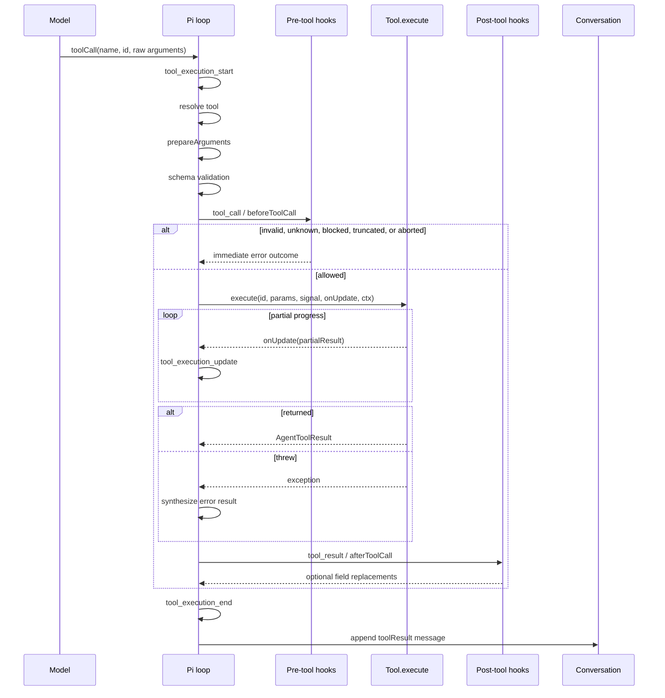
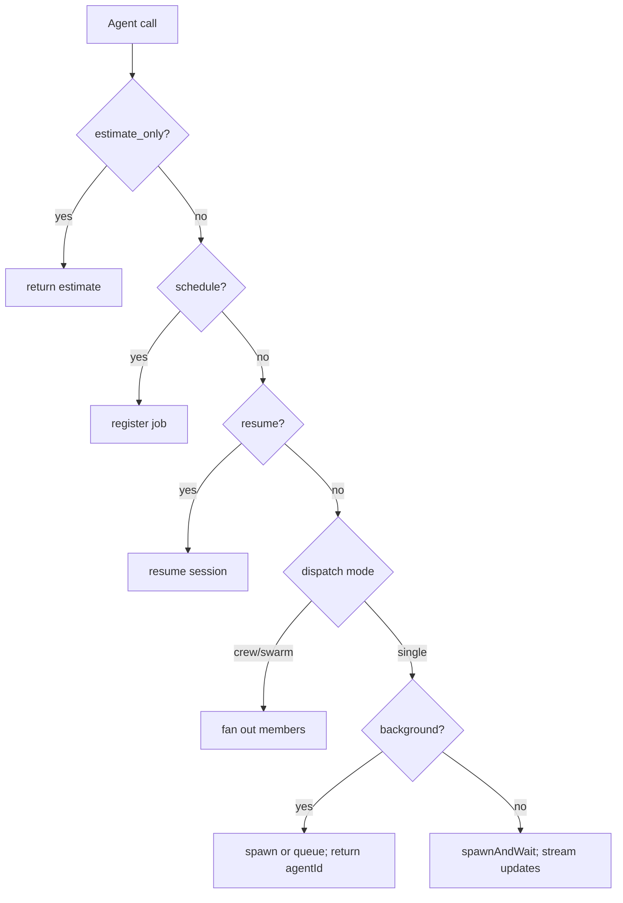
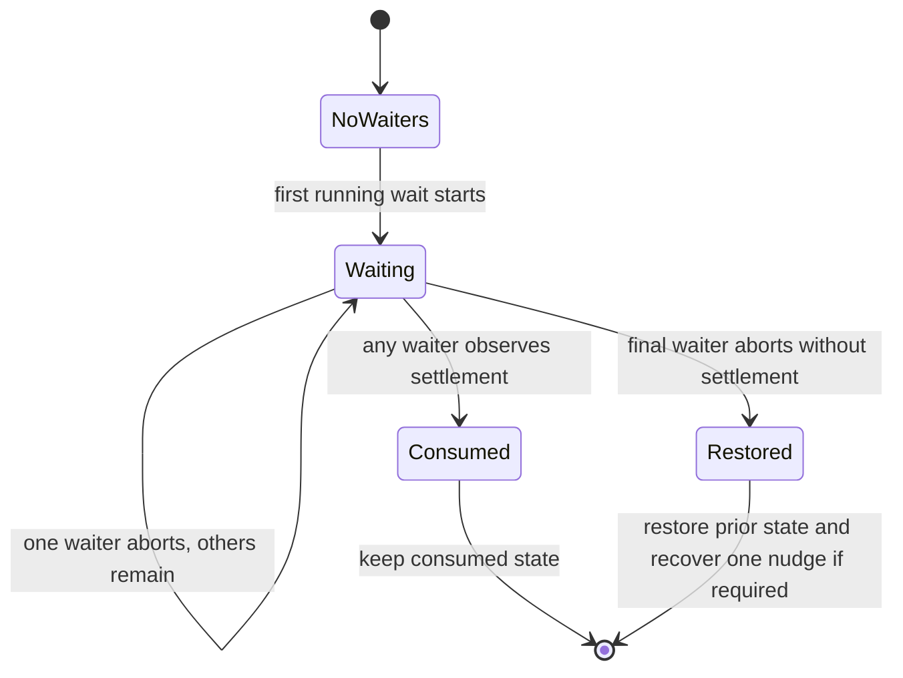
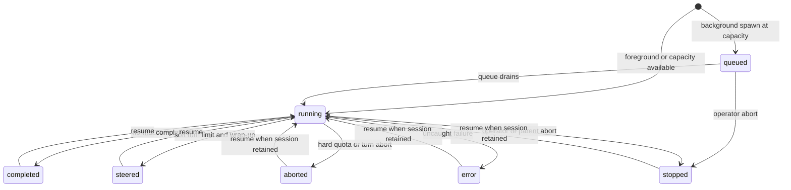
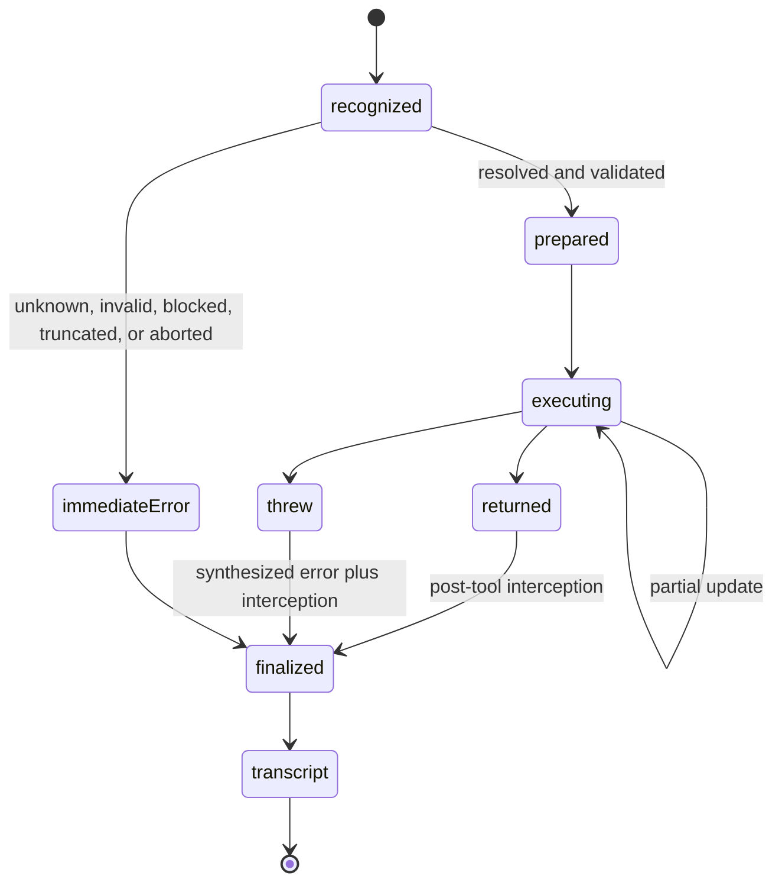

# Tool Calling and Tool Execution Contract

> **Status:** Normative implementation reference for `@onlinechefgroep/pi-agent-orchestrator`.
> **Host baseline:** `@earendil-works/pi-coding-agent >= 0.80.10`.
> **Scope:** Pi tool definitions, execution, cancellation, updates, steering, subagent orchestration, result ownership, telemetry, and failure handling.

This document defines both the required tool-calling contract and the current conformance state of this repository. Required behavior is not presented as implemented when a known deviation still exists.

## Conformance status

| Area | Current status |
| --- | --- |
| Pi tool-call preflight, validation, hooks, updates, and transcript ordering | Implemented by the supported Pi host |
| `get_subagent_result(wait:true)` for a running agent | Cancellable and concurrency-safe after #324 |
| `get_subagent_result(wait:true)` for a queued agent | Waits on the spawn-time completion promise after #327 |
| Single-agent foreground `Agent` cancellation | Parent tool signal propagates to the child session |
| Foreground crew/swarm cancellation | Parent abort stops every member and rejects with `AbortError` after #327 |
| Foreground crew/swarm completion waiting | Every member exposes a stable spawn-time completion promise after #327 |
| Multiple model-emitted `Agent` calls in one assistant message | `Agent` declares `executionMode: "sequential"` after #327 |

---

## 1. What a tool call is

A tool call is a structured request emitted by a model inside an assistant message. The model does not invoke JavaScript directly. Pi owns the execution boundary.

```text
model output
  └─ assistant content block: toolCall(name, id, arguments)
       └─ Pi resolution and validation
            └─ extension hooks
                 └─ tool.execute(...)
                      └─ zero or more partial updates
                           └─ final result or thrown error
                                └─ toolResult message in transcript
```

The distinction matters operationally:

- a model can request an unknown tool;
- arguments can fail schema validation;
- a hook can block the call before `execute` runs;
- cancellation can be active before execution begins;
- an execution can throw after partial updates;
- the final model-visible result is produced by Pi, not written directly into the transcript by the tool.

### 1.1 Required vocabulary

| Term | Meaning | Identity |
| --- | --- | --- |
| Tool definition | Registered capability with schema and `execute` | tool name |
| Tool call | Structured model request | `toolCallId` |
| Tool execution | Runtime invocation corresponding to a call | same `toolCallId` |
| Tool update | Partial result while execution remains active | same `toolCallId` |
| Tool result | Final success or error payload | same `toolCallId` |
| Agent record | Orchestrator lifecycle record | `agentId` |
| Agent session | Nested Pi runtime used by a subagent | session identity |
| Correlation ID | Telemetry identity across an agent lifetime | `correlationId` |
| Steering message | Message inserted before a later model request | queue entry, not a tool call |
| Follow-up message | Message delivered after the agent would otherwise stop | queue entry, not a tool call |

`toolCallId`, `agentId`, and `correlationId` are not interchangeable:

- `toolCallId` identifies one model-requested execution;
- `agentId` identifies one orchestrated subagent record;
- `correlationId` joins spans and events across that agent's lifetime, including resume operations.

---

## 2. Runtime layers

Tool calling crosses four layers.

```text
Provider / model
  emits structured tool-call blocks
        │
        ▼
Pi agent loop
  resolve → prepare → validate → schedule → execute → finalize
        │
        ▼
Pi coding-agent extension runtime
  ExtensionContext, hooks, rendering, host cancellation
        │
        ▼
pi-agent-orchestrator
  AgentManager, nested sessions, queues, steering, notifications,
  result ownership, groups, swarms, telemetry, output transcripts
```

### 2.1 Provider layer

Provider output is untrusted input. A syntactically valid tool-call block can still:

- reference an unavailable tool;
- contain the wrong argument shape;
- violate semantic cross-field constraints;
- be incomplete because generation ended early;
- request several tools that Pi will schedule concurrently.

### 2.2 Pi agent loop

Pi owns:

- tool lookup;
- optional compatibility preparation;
- TypeBox validation;
- sequential or parallel scheduling;
- abort-signal propagation;
- partial update events;
- exception-to-error-result conversion;
- pre-tool and post-tool interception;
- deterministic tool-result transcript ordering.

### 2.3 Extension runtime

The coding-agent extension layer provides:

- the fifth `execute` argument, `ExtensionContext`;
- `tool_call` and `tool_result` interception;
- custom call/result renderers;
- host UI, mode, model, working-directory, session, and trust context;
- access to the current host abort operation.

### 2.4 Orchestrator layer

The orchestrator adds a second lifecycle around nested agents:

- `Agent` creates or resumes an `AgentRecord`;
- `AgentManager` starts it immediately or queues it;
- a nested `AgentSession` runs its own model/tool loop;
- `steer_subagent` injects a future-turn message;
- `get_subagent_result` inspects or consumes the record;
- completion can be delivered by explicit retrieval or automatic notification.

This second lifecycle explains the original bug: the parent tool call could be blocked while the nested background agent itself remained healthy.

---

## 3. Canonical Pi lifecycle



### 3.1 Event meanings

| Event | Meaning | Important fields |
| --- | --- | --- |
| `tool_execution_start` | Pi recognized a call and started preflight | `toolCallId`, `toolName`, raw `args` |
| `tool_call` | Extension pre-execution interception | `toolCallId`, `toolName`, input |
| `tool_execution_update` | Partial result emitted | `toolCallId`, `toolName`, partial result |
| `tool_result` | Extension post-execution interception | content, details, usage, `isError` |
| `tool_execution_end` | Finalized outcome available | result and `isError` |
| Transcript `toolResult` | Durable model-visible result | call ID, tool name, content |

`tool_execution_start` does not prove that `execute` ran. Unknown tools, invalid input, blocked calls, pre-aborted calls, and truncated provider output can finish as immediate error outcomes.

### 3.2 Preflight order

Pi performs the following logical sequence:

1. Resolve the tool by exact name.
2. Apply `prepareArguments` when present.
3. Validate against the TypeBox schema.
4. Run extension pre-tool interception.
5. Check cancellation.
6. Execute or create an immediate error outcome.

`prepareArguments` is a compatibility shim. It should normalize legacy input into the canonical schema, not become an unrestricted parser.

### 3.3 Hook authority

Pre-tool hooks can block a call or replace its input. Post-tool hooks can replace content, details, usage, and error state.

Consequences:

- validation is not authorization;
- hook code is privileged policy code;
- a pre-hook that mutates validated input must preserve the schema invariant itself;
- post-hook field replacements are replacements, not implied deep merges;
- forensic tooling should record both original and effective values where possible.

---

## 4. Tool definition contract

The supported Pi extension contract is conceptually:

```ts
import type { Static, TSchema } from "@sinclair/typebox";

interface ToolDefinition<
  TParams extends TSchema,
  TDetails = unknown,
  TState = unknown,
> {
  name: string;
  label: string;
  description: string;
  promptSnippet?: string;
  promptGuidelines?: string[];
  parameters: TParams;
  prepareArguments?: (raw: unknown) => Static<TParams>;
  executionMode?: "sequential" | "parallel";

  execute(
    toolCallId: string,
    params: Static<TParams>,
    signal: AbortSignal | undefined,
    onUpdate: ((partial: AgentToolResult<TDetails>) => void) | undefined,
    ctx: ExtensionContext,
  ): Promise<AgentToolResult<TDetails>>;

  renderCall?: (...args: unknown[]) => Component;
  renderResult?: (...args: unknown[]) => Component;
}
```

`TParams` is the schema type. `Static<TParams>` is the validated runtime value type. Treating `TParams` itself as the runtime argument shape is incorrect.

### 4.1 `name`

The model-facing protocol identifier. Renaming it breaks prompts, transcripts, hooks, and integrations that address the tool by name.

Repository tool names:

- `Agent`
- `get_subagent_result`
- `steer_subagent`

### 4.2 `label`

Human-readable UI text. It is presentation, not protocol identity.

### 4.3 `description`

The model-facing behavioral contract. It should state:

- the operation;
- preconditions;
- blocking versus background behavior;
- cancellation scope;
- incompatible parameter combinations;
- required next steps and returned identifiers.

Descriptions affect execution quality. They are not decorative copy.

### 4.4 `parameters`

The TypeBox schema is the structural validation boundary. Prefer:

- closed enums over arbitrary strings where possible;
- explicit optionality;
- numeric ranges;
- precise defaults;
- documented incompatibilities;
- no hidden coercion after validation.

Cross-field semantic rules must be checked before side effects. Examples include `schedule` versus `resume`, or `estimate_only` versus spawning.

### 4.5 `executionMode`

Pi defaults a multi-call assistant message to parallel execution. A tool can declare `sequential` when ordering or mutual exclusion is required.

A single sequential tool in a batch causes the batch to execute sequentially. Long duration alone is not a reason to choose sequential mode; shared-state correctness is.

The `Agent` tool declares `executionMode: "sequential"` so multiple model-emitted `Agent` calls in one assistant message follow the documented foreground ordering.

### 4.6 Renderers

`renderCall` and `renderResult` are optional presentation. Correctness must not depend on TUI rendering because RPC, JSON, print, and non-interactive modes can render differently or not at all.

---

## 5. The five `execute` arguments

### 5.1 `toolCallId`

Use `toolCallId` for per-invocation state and correlation.

Valid uses:

- progress maps;
- renderer state;
- partial-update deduplication;
- event correlation;
- associating an `AgentRecord` with the parent call that created it.

Invalid uses:

- persistent identity across retries;
- replacing `agentId`;
- grouping an entire resumed agent lifetime.

The orchestrator stores the originating call ID on background records for grouping and UI correlation.

### 5.2 `params`

`params` have passed structural validation, but the tool must still validate domain state:

- target record exists;
- target status permits the operation;
- flags are semantically compatible;
- budgets and depth limits permit spawning;
- filesystem or project state permits worktree isolation;
- authorization and trust policy permit the side effect.

Run these checks before creating sessions, worktrees, timers, files, branches, or remote mutations.

### 5.3 `signal`

`signal` is the cancellation contract for the current tool execution. It may already be aborted when execution starts.

Minimum entry check:

```ts
if (signal?.aborted) {
  throw signal.reason instanceof Error
    ? signal.reason
    : new DOMException("Operation aborted", "AbortError");
}
```

Pass or bridge it through every blocking operation:

```ts
await fetch(url, { signal });
await pi.exec("command", args, { signal });
await waitForPromiseOrAbort(promise, signal);
```

An arbitrary Promise does not become cancellable merely because `execute` received a signal.

```ts
// Non-cancellable unless the underlying promise observes the signal.
await record.promise;
```

### 5.4 `onUpdate`

`onUpdate` emits partial `AgentToolResult` values while execution remains active.

Suitable data:

- elapsed time;
- progress counters;
- active tool names;
- bounded output previews;
- token/turn statistics;
- renderer-specific structured details.

Properties:

- updates are not final transcript results;
- updates can arrive many times;
- updates can be dropped or coalesced by presentation layers;
- updates after settlement are ignored;
- final correctness cannot depend on every update being rendered.

Foreground `Agent` execution uses updates for spinner, activity, tool count, turns, and token usage. Background execution returns control and moves observability to persistent widget state and completion notifications.

### 5.5 `ctx`

`ExtensionContext` exposes execution context such as:

- working directory;
- host mode;
- current model;
- session manager;
- UI APIs;
- trust state;
- host abort controls.

The explicit `signal` belongs to this tool invocation. `ctx.abort()` aborts the current host operation. Do not retain a context indefinitely as a process-global singleton; session switches and reloads can replace it.

---

## 6. Result and error contract

A final result conceptually contains:

```ts
interface AgentToolResult<TDetails> {
  content: Array<TextContent | ImageContent>;
  details: TDetails;
  usage?: Usage;
  addedToolNames?: string[];
  terminate?: boolean;
}
```

### 6.1 `content`

`content` is model-visible. It must be:

- sufficient for the next reasoning step;
- explicit about follow-up identifiers;
- bounded when raw output is large;
- accurate about queued, running, and terminal state;
- free of UI-only decoration.

A background spawn must return the `agentId` because later result and steering calls depend on it.

### 6.2 `details`

`details` is structured UI and observability data. It can include status, duration, tokens, activity, validation state, renderer tags, and agent identity.

The model should not require custom `details` to understand the operation. The durable model-facing protocol is `content`.

### 6.3 `usage`

Use `usage` for resources generated by the tool itself, such as nested model work. It is separate from the parent model request's usage.

### 6.4 `terminate`

`terminate` is an early-stop hint. Pi only ends a parallel tool batch early when every finalized result in that batch requests termination. One tool cannot silently discard sibling calls.

### 6.5 Throw versus normal result

Throw for execution failure:

```ts
throw new Error("Agent record no longer exists");
```

Return normally for expected domain-state responses when the tool contract defines them as valid outcomes.

Do not return success-shaped text that merely contains the word `Error` for a genuine execution failure. Pi needs the thrown path to mark `isError` correctly.

---

## 7. Parallel and sequential execution

### 7.1 Parallel ordering

When Pi executes a tool batch in parallel:

1. Calls are discovered in assistant-message order.
2. Start/preflight events occur in source order.
3. Allowed executions overlap.
4. Partial updates arrive in runtime order.
5. end events arrive in completion order.
6. Final tool-result messages are appended in original source order.

This preserves a deterministic transcript without discarding concurrency.

Never infer completion order from transcript order. Never correlate concurrent calls by tool name alone; use `toolCallId`.

### 7.2 Shared-state hazards

Typical races:

- two calls mutate one boolean ownership flag;
- two calls perform file read-modify-write without a lock;
- cancellation restores state captured before another caller changed it;
- completion publishes while a waiter is claiming the same result;
- a stale update overwrites newer renderer state;
- two calls remove the same listener or timer.

Use one of:

- per-call state keyed by `toolCallId`;
- a per-resource coordinator with reference counts;
- a mutex or serialized queue;
- immutable snapshots with compare-and-swap semantics;
- idempotent publication with a delivery token.

A shared boolean is generally insufficient when several callers can claim the same resource.

---

## 8. Cancellation contract

Cancellation has scope. A wait cancellation, parent-tool cancellation, and subagent termination are different operations.

| Operation | Intended cancellation target | Current behavior |
| --- | --- | --- |
| Esc during single foreground `Agent` | parent tool and child session | Signal propagates to child |
| Esc during foreground crew/swarm `Agent` | parent tool and every foreground member | Implemented after #327; members stop and parent rejects with `AbortError` |
| Esc during running-agent `get_subagent_result(wait:true)` | only that blocking wait | Implemented after #324; agent continues |
| `get_subagent_result(wait:true)` on queued record | wait until eventual terminal state | Implemented after #327 |
| `/agents` terminate or manager abort | selected agent | Agent is stopped; queued record is removed from queue |
| Turn/tool quota abort | nested agent session | Agent stops fail-closed |
| Steering | no cancellation | Message waits for the next drain point |

### 8.1 Cancellable Promise pattern

```ts
async function waitForPromiseOrAbort<T>(
  promise: Promise<T>,
  signal?: AbortSignal,
): Promise<T> {
  if (!signal) return await promise;
  if (signal.aborted) throw abortError(signal);

  return await new Promise<T>((resolve, reject) => {
    let settled = false;

    const cleanup = () => signal.removeEventListener("abort", onAbort);
    const finish = (fn: () => void) => {
      if (settled) return;
      settled = true;
      cleanup();
      fn();
    };
    const onAbort = () => finish(() => reject(abortError(signal)));

    signal.addEventListener("abort", onAbort, { once: true });

    // Close the race between the first check and listener registration.
    if (signal.aborted) return onAbort();

    promise.then(
      value => finish(() => resolve(value)),
      error => finish(() => reject(error)),
    );
  });
}
```

Required properties:

- fail immediately for an already-aborted signal;
- close the check/listener race;
- register once;
- remove the listener after either side settles;
- preserve `AbortError` identity;
- cancel the underlying operation only when that scope is intended.

### 8.2 Cleanup

Every long-lived execution must clean up in `finally`:

- abort listeners;
- session subscriptions;
- intervals and timeouts;
- OTel spans;
- file streams;
- polling loops;
- temporary ownership state;
- temporary worktrees when the lifecycle owns them.

Cancellation is a normal control path. It is not permission to skip cleanup.

### 8.3 Abort propagation

For parent-child execution, attach the parent signal before the child can start meaningful work and handle an already-aborted parent. Detach the listener when the child becomes terminal.

Background work that should outlive the spawning tool must not accidentally retain a parent-tool signal whose lifecycle has ended.

---

## 9. Steering and follow-ups

Pi maintains two distinct future-message paths:

- steering is delivered after the current assistant turn finishes its active tool calls and before the next model request;
- follow-up is delivered after the agent would otherwise become idle.

### 9.1 Steering is not an interrupt

`session.steer(message)` queues a message. It does not preempt arbitrary JavaScript inside a running tool.

```text
active tool execution
  ├─ steering message is queued
  ├─ tool continues until return, throw, or abort
  └─ steering reaches the model before the next model request
```

Responsive control requires at least one of:

- abort-aware blocking operations;
- bounded chunks with checkpoints;
- a domain-level control channel;
- background execution that returns the parent loop immediately.

### 9.2 Parent steering versus subagent steering

Typing while the parent Pi session is active targets the parent queue. Calling `steer_subagent` targets a nested subagent session. They are separate queues.

### 9.3 `steer_subagent` behavior

The orchestrator:

1. resolves `agent_id`;
2. rejects missing or non-running records;
3. stores the message in `pendingSteers` when the session is not ready;
4. otherwise calls `session.steer(message)`;
5. emits a steering lifecycle event;
6. returns after queueing, not after the agent acts on it.

`AgentManager` flushes `pendingSteers` when the nested session is created.

---

## 10. Orchestrator tools

### 10.1 `Agent`

`Agent` can estimate, schedule, resume, dispatch coordinated members, spawn in the background, or run one foreground child.



#### Single foreground execution

Current behavior:

- bypasses the background concurrency queue;
- passes the parent signal to the child record/session;
- streams activity through `onUpdate`;
- blocks until the child record becomes terminal;
- Esc stops the child.

#### Background execution

Current behavior:

- creates a record and returns immediately;
- record may be `running` or `queued`;
- returns the agent ID and optional output-file path;
- widget state continues independently;
- completion notification is sent unless explicit result ownership suppresses it.

#### Coordinated foreground crew/swarm execution

Current implementation reuses background-member infrastructure for coordination. It spawns members, flushes group/swarm registration, then aggregates their record promises.

Required behavior (implemented by #327):

- assign one stable completion promise before `spawn()` returns;
- settle it exactly once for completion, error, stop, queued abort, and startup failure;
- propagate the parent signal to every foreground member;
- abort the full fan-out on parent Esc;
- keep background fan-out independent after the spawning tool returns.

### 10.2 `get_subagent_result`

Purpose: inspect or consume a background record.

#### Current modes

| Parameters and record state | Current behavior |
| --- | --- |
| `wait` omitted or false | Immediate snapshot |
| `wait:true`, record `running` or `queued`, and promise initialized | Abort-aware wait until the promise settles |
| `verbose:true` | Adds serialized conversation and tool-call history when a session exists |

`wait:true` waits for both queued and running records once the spawn-time completion promise exists.

#### Running-agent cancellation contract

- Esc cancels only the result wait;
- the background agent continues;
- cancelling the wait does not permanently consume the future result;
- if another waiter remains active, notification suppression remains active;
- if any waiter observes settlement, the result remains consumed;
- when all waiters abort during a terminal race, one notification is recovered.

#### Concurrent waiter state



The implementation uses shared per-record coordination. Independent boolean snapshots are unsafe because one cancelled waiter could re-enable notification while another waiter is still consuming the result.

### 10.3 `steer_subagent`

Contract:

- target must exist and be `running`;
- a pre-session message is queued;
- an initialized session receives `session.steer`;
- delivery occurs after the active nested tool batch;
- steering does not cancel that tool;
- the call returns after the message is queued.

---

## 11. Result ownership and notifications

Background completion can reach the parent through two paths:

- pull: explicit `get_subagent_result`;
- push: automatic completion follow-up.

Required invariant:

> Explicit retrieval may have several callers, but automatic completion publication occurs at most once and is not lost when every blocking caller cancels.

### 11.1 `resultConsumed`

`AgentRecord.resultConsumed` suppresses automatic publication when an explicit caller owns the result.

It is not sufficient as a standalone concurrency primitive. Blocking retrieval also needs shared waiter coordination so that:

- the first waiter claims ownership before awaiting;
- additional waiters increment shared state;
- one cancellation cannot restore ownership prematurely;
- the final cancellation restores the state that existed before the first waiter;
- a terminal notification suppressed during the race can be recovered once.

### 11.2 Completion ordering

The manager's completion chain updates the record and runs completion side effects before an awaiting result tool resumes. Ownership must therefore be claimed before awaiting, or both pull and push can deliver the same result.

### 11.3 Terminal abort race

```text
waiter marks result consumed
agent becomes terminal
completion callback suppresses notification
wait abort wins its race
```

When no waiter observed settlement and every waiter cancelled, restore prior ownership and schedule exactly one terminal notification.

---

## 12. State machines

### 12.1 Agent record lifecycle



### 12.2 Tool execution lifecycle



---

## 13. Telemetry and observability

The nested runner tracks or emits:

- turn count;
- tool-call count;
- active tool names;
- token input/output/cache write;
- time to first token;
- compaction count;
- agent, turn, and tool spans;
- one stable correlation ID per agent record.

### 13.1 Counting caveat

Quota accounting can increment at `tool_execution_start`, while user-facing `record.toolUses` increments on tool activity end. Counts can differ temporarily and can differ around failed preflight or interrupted execution.

A tool count is not transactional proof that a side effect committed.

### 13.2 Correlation

Use:

- `toolCallId` for one execution;
- `agentId` for dashboard and lifecycle state;
- `correlationId` for an agent's complete telemetry lifetime.

### 13.3 Verbose result export

`get_subagent_result(verbose:true)` is an operator-oriented summary containing user/assistant text, tool names, and bounded tool-result content. It is not a lossless event log. Use debug capture or OTel for complete forensics.

---

## 14. Security and capability boundaries

### 14.1 Tool availability is authority

A model can only request tools active in its session. The orchestrator filters child capabilities through:

- agent-profile base tools;
- parent permission intersection;
- partition membership;
- explicit deny lists;
- extension inheritance policy.

The orchestration tools are excluded from ordinary child inheritance to prevent uncontrolled recursive orchestration. Explicit recursion must remain bounded by task budgets and level limits.

### 14.2 Validation is not authorization

A valid schema proves shape, not permission. Authorization, project trust, tenancy, partition, and side-effect policy remain separate gates.

### 14.3 Isolation controls

`isolated:true` restricts extension and MCP capability inheritance. `isolation:"worktree"` isolates filesystem edits in a temporary git worktree. These controls are distinct and can be combined.

### 14.4 Output handling

Tool output may contain untrusted repository text, command output, remote content, or another model's response. Do not treat returned text as privileged instructions. Preserve provenance and bound transcript size.

---

## 15. Normative invariants

### Protocol

- **1.** Tool names are stable protocol identifiers.
- **2.** Every model-visible input has a schema.
- **3.** Semantic validation precedes side effects.
- **4.** Final content exposes every identifier required for follow-up calls.
- **5.** Execution failures throw; expected domain responses return normally.

### Cancellation

- **6.** Every blocking boundary is abort-aware, including foreground crew/swarm.
- **7.** Already-aborted signals fail immediately.
- **8.** Abort listeners are removed after settlement.
- **9.** Cancellation scope is explicit: wait, parent tool, or agent.
- **10.** Cancelling a result wait never cancels the background agent.
- **11.** `AbortError` is not accidentally converted into success.

### Concurrency

- **12.** Concurrent calls correlate by `toolCallId`, not tool name.
- **13.** Shared ownership uses coordinated state, not independent boolean snapshots.
- **14.** Shared file or process mutations are serialized or idempotent.
- **15.** Partial updates cannot determine final correctness.
- **16.** Final transcript order remains deterministic.

### Delivery

- **17.** Explicit consumption suppresses duplicate automatic publication.
- **18.** Cancellation cannot permanently lose an unconsumed result.
- **19.** Terminal abort races recover publication at most once.
- **20.** Notification timers re-check ownership at send time.

### Lifecycle

- **21.** Subscriptions, timers, spans, streams, and worktrees are cleaned up.
- **22.** Every foreground child follows parent abort, including crew/swarm fan-out.
- **23.** Background child lifetime is independent after the spawning tool returns.
- **24.** Steering is queued until the active tool batch finishes.
- **25.** Agent, turn, and tool quotas fail closed.
- **26.** Every spawned record exposes one stable completion promise before `spawn()` returns.
- **27.** `get_subagent_result(wait:true)` waits across queued and running states.

---

## 16. Authoring template

```ts
import { defineTool } from "@earendil-works/pi-coding-agent";
import { Type } from "@sinclair/typebox";

export const exampleTool = defineTool({
  name: "example",
  label: "Example",
  description: "Run a cancellable example operation.",
  parameters: Type.Object({
    resource_id: Type.String(),
  }),
  executionMode: "parallel",

  async execute(toolCallId, params, signal, onUpdate, ctx) {
    if (signal?.aborted) {
      throw signal.reason instanceof Error
        ? signal.reason
        : new DOMException("Operation aborted", "AbortError");
    }

    onUpdate?.({
      content: [{ type: "text", text: "Starting…" }],
      details: { toolCallId, phase: "starting" },
    });

    const result = await runCancellableOperation(
      params.resource_id,
      signal,
    );

    return {
      content: [{ type: "text", text: result.summary }],
      details: {
        toolCallId,
        cwd: ctx.cwd,
        resourceId: params.resource_id,
        phase: "completed",
      },
    };
  },
});
```

Review questions:

- Can any `await` remain pending after Esc?
- Does cancellation stop exactly the intended scope?
- Can two calls target the same mutable resource?
- Is every listener, timer, stream, and subscription cleaned up?
- Can a partial update arrive after settlement?
- Is failure distinguishable from a normal domain result?
- Does final content expose required follow-up IDs?
- Does correctness survive non-TUI modes?

---

## 17. Test matrix

| Category | Required coverage |
| --- | --- |
| Schema | valid input, missing required input, invalid enum/range, compatibility preparation |
| Semantic validation | incompatible flags, missing target, wrong status, no side effects on rejection |
| Success | normal return, structured details, required identifiers |
| Failure | synchronous throw, async rejection, post-hook failure |
| Cancellation | pre-aborted signal, abort during wait, nested abort, listener cleanup |
| Updates | no update, several updates, no accepted update after settlement |
| Parallelism | different resources, same resource, reverse completion order |
| Ownership | explicit consumption, notification suppression, all waiters cancelled, mixed abort/completion |
| Lifecycle | queued, starting, running, completed, error, stopped, resumed |
| Rendering | partial, final, expanded, absent details, non-TUI mode |
| Telemetry | balanced start/end, span cleanup, stable correlation ID |

### 17.1 Concurrent result-wait regression

```text
waiter A starts → waiter B starts → A aborts
expected: ownership remains claimed while B is active
agent completes → B returns result
expected: no automatic duplicate notification
```

```text
waiter A starts → waiter B starts → record becomes terminal
A aborts → B aborts
expected: prior ownership restored and exactly one notification recovered
```

### 17.2 Queued result-wait regression

Required by #327:

```text
agent is queued → get_subagent_result(wait:true) starts
expected after stable-promise fix: call remains pending
queue drains → agent runs → agent completes
expected: call returns the terminal result
```

### 17.3 Foreground fan-out regression

Required by #327:

```text
foreground crew/swarm starts → one member is queued or worktree-starting
expected: parent stays pending until every member is terminal
```

```text
foreground crew/swarm starts → parent Esc
expected: all foreground members stop, parent rejects with AbortError,
and every completion promise settles exactly once
```

---

## 18. Troubleshooting

| Symptom | Likely cause | Corrective action |
| --- | --- | --- |
| Esc appears ignored | Blocking operation does not observe `signal` | Pass or race the signal and preserve `AbortError` |
| Esc ignored during foreground crew/swarm | Parent signal not wired to members | Ensure foreground fan-out passes `signal` into each spawn |
| `wait:true` returns immediately for queued agent | Missing spawn-time completion promise | Await `record.promise` for queued and running waits |
| Steering is queued but nothing changes | Active tool has not finished | Abort/chunk the tool or wait for its drain point |
| Crew/swarm reports completion while member is queued | Optional promise read before initialization | Use the stable spawn-time completion promise |
| Result appears twice | Pull consumption raced push notification | Claim ownership before waiting and coordinate callers |
| Result disappears after cancelled wait | Ownership remained consumed | Restore prior ownership when final waiter cancels |
| One of two cancelled waits causes duplicate notification | Independent boolean restoration | Use shared active-waiter state |
| Tool count exceeds committed side effects | Lifecycle count is not transaction count | Inspect final `isError`, result, and domain audit evidence |
| UI progress freezes while execution continues | Update/render issue | Keep correctness independent of `onUpdate` |
| Background agent cannot be steered | Record queued, terminal, or missing | Steer only a running record; pre-session running messages use `pendingSteers` |
| Child stops with parent unexpectedly | Child inherited parent cancellation | Use background lifetime when the child must outlive the tool call |

---

## 19. Source map

| Concern | Primary source |
| --- | --- |
| Agent schema and execution branches | `src/tools/agent.ts` |
| Result wait, cancellation, and ownership | `src/tools/get-result.ts` |
| Steering | `src/tools/steer.ts` |
| Records, queues, promises, abort controllers | `src/agent-manager.ts` |
| Nested Pi session and tool events | `src/agent-runner.ts` |
| Completion notifications | `src/index.ts` |
| Result formatting | `src/tool-result-helpers.ts` |
| Lifecycle types | `src/types.ts` |
| Result-wait tests | `test/tools-get-result.test.ts` |
| Agent tool tests | `test/tools-agent.test.ts` |
| Coordinated dispatch tests | `test/orchestration-dispatch-integration.test.ts` |
| Foreground lifecycle hardening | GitHub issue `#327` |
| Upstream low-level tool contract | Pi `packages/agent/src/types.ts` and `packages/agent/src/agent-loop.ts` |
| Upstream extension contract | Pi `packages/coding-agent/src/core/extensions/types.ts` |

When upgrading the Pi peer dependency, diff the upstream types and agent loop before raising the minimum supported version. Re-verify:

- `ToolDefinition.execute` arguments;
- `Static<TParams>` inference;
- default execution mode;
- preflight and event ordering;
- hook replacement semantics;
- abort propagation;
- update acceptance after settlement;
- steering/follow-up drain points;
- early termination semantics.
